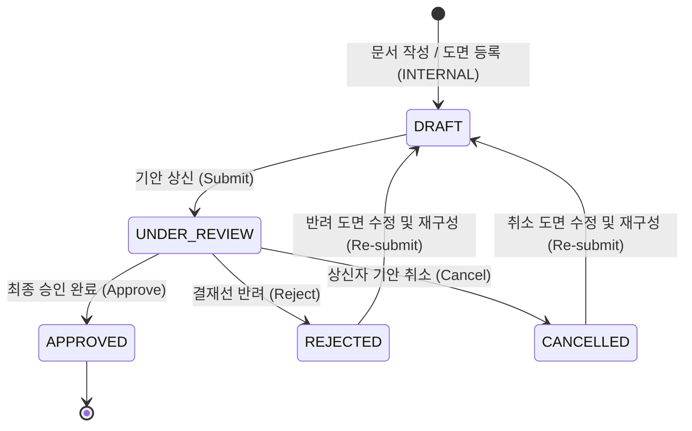
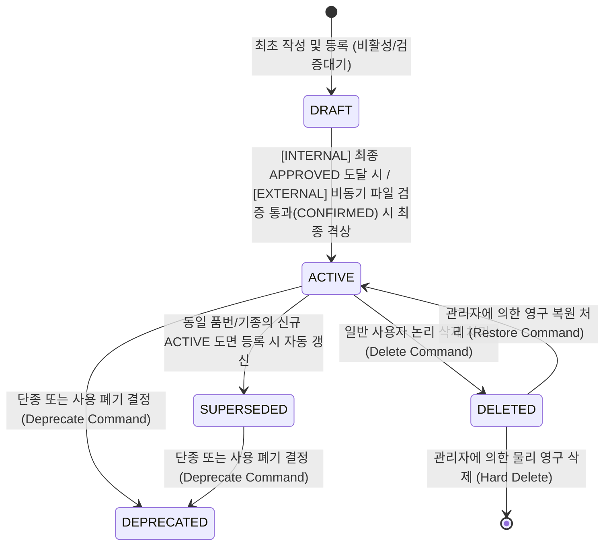
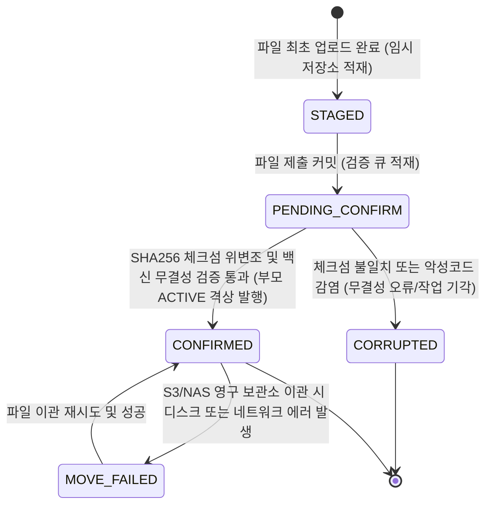
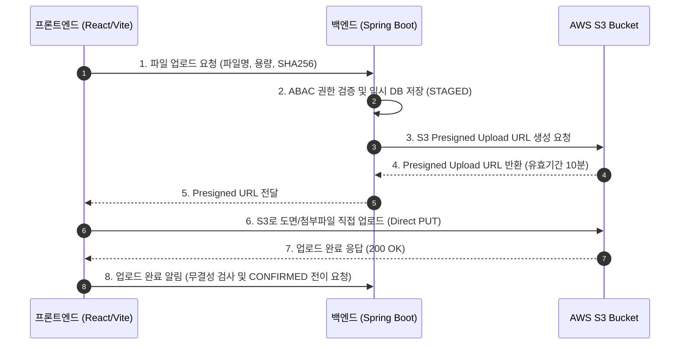
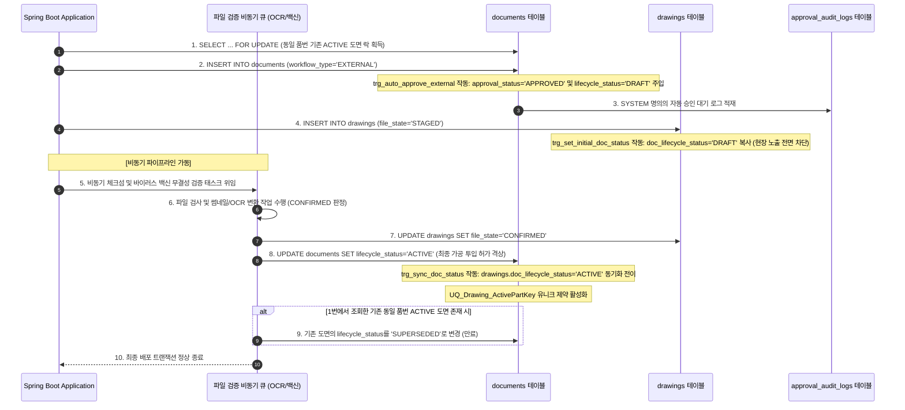

작성일: 2026년 7월 21일
작성자: PRODEV

## 1. 개요 및 설계 대수술 배경
안녕하세요, **PROCPA**입니다.
이전 v5.4까지의 아키텍처에 잔존하고 있던 **EXTERNAL 도면의 무결성 검증 갭(비동기 검사 도중 구버전이 ACTIVE로 선배포되는 맹점)과, 1:1 INSERT 관계에서의 유니크 키 충돌 회복 흐름 누락**은 대규모 공정 유통 시 치명적인 데이터 충돌 및 정보 유출 사고를 일으킬 수 있는 실제적인 아키텍처 결함입니다.

바이어 도면(EXTERNAL) 등록 즉시 `approval_status = 'APPROVED'`는 할당하되 `lifecycle_status`는 `DRAFT(또는 PENDING_ACTIVE)` 상태로 대기시키고, 비동기 검사(`file_state = 'CONFIRMED'`)가 100% 안전하게 통과되는 즉시 비동기 이벤트 핸들러가 부모의 `lifecycle_status`를 `ACTIVE`로 격상시키도록 수정한 **최종 완결형 도메인 및 백엔드 상세 설계서(v5.5)**를 작성하여 제시합니다.

---

## 2. 엔터프라이즈 도메인 모델 및 상태 삼원화 (Three-Way Status Model)
상태값의 폭발적 증가와 조건문 난립을 원천 방지하기 위해, 문스터와 도면의 상태 모델을 3가지 물리 영역으로 명확히 구분 설계합니다.

**1. 결재 진행 상태 (Approval Status)**
  - **상태값:** `DRAFT(기안전) ➔ UNDER_REVIEW(심사중) ➔ APPROVED(승인완료) / REJECTED(반려) / CANCELLED(기안취소)`

**2. 라이프사이클 상태 (Lifecycle Status)**
  - **상태값:** `DRAFT(비활성/검증대기) ➔ ACTIVE(현장사용유효) ➔ SUPERSEDED(구버전만료) ➔ DEPRECATED(사용폐기) ➔ DELETED(논리삭제)`

**3. 스토리지 파일 상태 (File Status)**
  - **상태값:** `STAGED(임시저장) ➔ PENDING_CONFIRM(검증대기) ➔ CONFIRMED(정상완료) ➔ MOVE_FAILED(이관오류) ➔ CORRUPTED(무결성오류)`

---

## 3. 삼원화 상태 전이 매트릭스 및 Mermaid 다이어그램 (State Machine)

### 3.1. 결재 진행 상태 전이 흐름 (Approval Status Machine)


### 3.2. 라이프사이클 상태 전이 흐름 (Lifecycle Status Machine - 비동기 검사 연계 보완)


### 3.3. 스토리지 파일 상태 전이 흐름 (File Status Machine)


### 3.4. 클라우드 인프라 및 대용량 파일 스토리지 설계 (AWS S3 & Presigned URL)
정적 도면 파일 및 결재 첨부파일의 지속적 누적에 완벽히 대응하고 무제한 확장성과 비용 최적화를 달성하기 위해 **AWS S3(Amazon Simple Storage Service)** 기반 스토리지 아키텍처를 도입합니다.

**1. AWS S3 선택 사유 및 이점**
- **무제한 확장성 및 11 9's 내구성:** 디스크 용량 증설 관리 없이 무제한 데이터 누적을 지원하며 99.999999999% 객체 내구성을 보장합니다.
- **서버 네트워크 부하 0화:** 백엔드 애플리케이션(Spring Boot)을 거치지 않고 프론트엔드가 S3로 직접 파일 PUT/GET을 수행하여 서버 CPU 및 I/O 병목을 원천 해소합니다.

**2. S3 Presigned URL 대용량 파일 직접 업로드/다운로드 시퀀스**


**3. S3 Lifecycle(수명주기) 정책을 통한 보관 비용 90% 절감**
- **S3 Standard (자주 조회):** 현재 현장에 배포된 `ACTIVE` 상태 도면 및 결재 진행 중인 문서.
- **S3 Standard-IA (가끔 조회):** 승인 후 6개월이 경과한 구 버전 개정 도면(`SUPERSEDED`). (보관 비용 약 50% 절감)
- **S3 Glacier Flexible / Deep Archive (영구 보존):** 3년 이상 지난 법적 보존 결재 감사 이력 및 단종 도면(`DEPRECATED`). (보관 비용 약 90% 절감)

**4. AWS 스토리지 옵션 비교 및 보안 통제 (OAC & Presigned URL)**
- **스토리지 비교:** EBS/EFS 대비 S3는 GB당 보관 비용이 최저 수준(약 $0.023/GB)이며 Presigned URL을 통한 무세션 브라우저 다운로드를 유일하게 지원합니다.
- **S3 보안 통제:** 버킷 퍼블릭 액세스(`Block Public Access`)를 100% 차단하고, CloudFront OAC(Origin Access Control) 연동 및 15분 유효기간의 Presigned URL을 사용하여 무단 기밀 도면 유출을 원천 방어합니다.

---

## 4. 다차원 ABAC (속성 기반 권한) 및 데이터 접근 제어
역할(Role)에 단순 바인딩되는 RBAC의 제약을 극복하고, 보안 통제를 위해 사용자 속성 및 리소스 데이터 속성을 결합하는 데이터 범위(Data Scope) 제어 모델을 수립합니다.

**1. 역할 권한 매트릭스 장표 (Role Permission Matrix)**

| 기능 분류 | VIEWER | CREATOR | APPROVER | AUDITOR | ADMIN |
| :--- | :---: | :---: | :---: | :---: | :---: |
| **도면/문서 조회 (Read)** | O | O | O | O | O |
| **도면/문서 등록 (Create)** | X | O | X | X | O |
| **도면/문서 삭제 (Delete)** | X | O | X | X | O |
| **결재선 지정 및 기안 (Submit)** | X | O | X | X | O |
| **결재 심사 승인/반려 (Approve)**| X | X | O | X | O |
| **유출 비밀키 무효화 (Revoke)** | X | X | X | X | O |
| **감사 이력 원장 열람 (Audit)** | X | X | X | O | O |

**2. 데이터 범위 필터링 정책 (Data Scope)**
  - **생산/가공 현장 작업자 (VIEWER):** 소속 부서 및 담당 기종 속성이 일치하는 `ACTIVE` 등급의 도면만 조회 가능.
  - **도면 등급별 접근 제한:** `SecurityGrade`가 '1등급'인 기밀 도면은 `Role = ADMIN` 세션 혹은 해당 프로젝트의 명시적 참여 인원(`ProjectCode` 매핑)에게만 조회가 한정되며, 일반 VIEWER 권한은 탐색 목록에서 원천 필터링 배제.

---

## 5. 다차원 고속 검색 및 개인화 검색 도메인 설계 (Search Domain)
DMS의 대용량 도면 탐색 사용성을 극대화하기 위해 다차원 검색 필터링 조건과 개인화 저장 기능을 정의합니다.
- **다차원 필터링 검색 조건 표준:** `PartNo`(품번), `ModelGroup`(기종), `Revision`(버전), `Author`(작성자), `ApprovalStatus`(결재상태), `LifecycleStatus`(라이프사이클상태), `DateRange`(등록일 범위), `Department`(등록부서), `SecurityGrade`(보안등급), `HashTags`(도면 태그).
- **개인화 데이터 모델:** `saved_search_filters`(즐겨찾는 검색 조건), `recent_searches`(최근 검색 기록 5개).

---

## 6. 핵심 REST API 명세 규격 (API Specification)
백엔드가 외부에 제공하는 핵심 RESTful API 규격입니다.
- `GET /api/v1/documents` (DMS Explorer 조회)
- `POST /api/v1/documents` (신규 도면 등록 및 EXTERNAL 자동결재 바인딩)
- `PUT /api/v1/documents/{id}/revision` (비관적 락 개정)
- `GET /api/v1/verify` (1회용 복호화 난수 토큰 기반 정보 은닉 모바일 간이 검증)

---

## 7. MariaDB 11.4 물리 DDL 및 트리거 명세
상태값 삼원화 및 비동기 검사 동기화 격상을 위한 DDL 및 트리거 사양입니다.

```sql
-- 1. 일반 결재 및 도면 기안 문서 마스터 테이블
CREATE TABLE documents (
    id VARCHAR(36) NOT NULL,
    previous_version_document_id VARCHAR(36),
    document_no VARCHAR(50) NOT NULL,
    title VARCHAR(100) NOT NULL,
    document_type VARCHAR(20) NOT NULL, -- 'REQ', 'DRAW', 'PUR'
    workflow_type VARCHAR(20) NOT NULL, -- 'INTERNAL', 'EXTERNAL'
    approval_status VARCHAR(20) NOT NULL, -- DRAFT, UNDER_REVIEW, APPROVED, REJECTED, CANCELLED
    lifecycle_status VARCHAR(20) NOT NULL, -- DRAFT, ACTIVE, SUPERSEDED, DEPRECATED, DELETED
    security_grade VARCHAR(20) NOT NULL DEFAULT 'GRADE_3', 
    owner_department VARCHAR(50) NOT NULL, 
    project_code VARCHAR(50), 
    version_major INT NOT NULL DEFAULT 1,
    version_minor INT NOT NULL DEFAULT 0,
    version_lock BIGINT NOT NULL DEFAULT 0,
    created_at TIMESTAMP DEFAULT CURRENT_TIMESTAMP,
    updated_at TIMESTAMP DEFAULT CURRENT_TIMESTAMP ON UPDATE CURRENT_TIMESTAMP,
    active_previous_id VARCHAR(36) GENERATED ALWAYS AS (
        CASE WHEN previous_version_document_id IS NULL THEN id 
             ELSE previous_version_document_id 
        END
    ) STORED,
    PRIMARY KEY (id),
    CONSTRAINT FK_Doc_PreviousVersion FOREIGN KEY (previous_version_document_id) REFERENCES documents(id),
    CONSTRAINT UQ_Document_No_Version UNIQUE (document_no, version_major, version_minor),
    CONSTRAINT UQ_Doc_ActivePrevious UNIQUE (active_previous_id),
    CONSTRAINT CHK_Doc_WorkflowType CHECK (workflow_type IN ('INTERNAL', 'EXTERNAL')),
    CONSTRAINT CHK_Doc_ApprovalStatus CHECK (approval_status IN ('DRAFT', 'UNDER_REVIEW', 'APPROVED', 'REJECTED', 'CANCELLED')),
    CONSTRAINT CHK_Doc_LifecycleStatus CHECK (lifecycle_status IN ('DRAFT', 'ACTIVE', 'SUPERSEDED', 'DEPRECATED', 'DELETED'))
) ENGINE=InnoDB DEFAULT CHARSET=utf8mb4 COLLATE=utf8mb4_unicode_ci;

-- 2. 도면 상세 테이블
CREATE TABLE drawings (
    drawing_id VARCHAR(36) NOT NULL,
    part_no VARCHAR(50) NOT NULL,
    part_name VARCHAR(100) NOT NULL,
    model_group VARCHAR(50) NOT NULL, 
    drawing_type VARCHAR(20) NOT NULL, 
    storage_key VARCHAR(500) NOT NULL,
    original_file_name VARCHAR(255) NOT NULL,
    file_size BIGINT NOT NULL,
    checksum_sha256 VARCHAR(64) NOT NULL,
    linearized BOOLEAN NOT NULL DEFAULT FALSE,
    file_state VARCHAR(20) NOT NULL, 
    doc_approval_status VARCHAR(20) NOT NULL, 
    doc_lifecycle_status VARCHAR(20) NOT NULL, 
    hash_tags VARCHAR(500), 
    version_lock BIGINT NOT NULL DEFAULT 0,
    active_part_key VARCHAR(150) GENERATED ALWAYS AS (
        CASE WHEN doc_lifecycle_status = 'ACTIVE' THEN CONCAT(part_no, '_', model_group) 
             ELSE drawing_id 
        END
    ) STORED,
    PRIMARY KEY (drawing_id),
    CONSTRAINT FK_Drawing_Document FOREIGN KEY (drawing_id) REFERENCES documents(id) ON DELETE RESTRICT,
    CONSTRAINT UQ_Drawing_ActivePartKey UNIQUE (active_part_key),
    CONSTRAINT CHK_Drawing_FileState CHECK (file_state IN ('STAGED', 'PENDING_CONFIRM', 'CONFIRMED', 'MOVE_FAILED', 'CORRUPTED')),
    CONSTRAINT CHK_Drawing_ApprovalStatus CHECK (doc_approval_status IN ('DRAFT', 'UNDER_REVIEW', 'APPROVED', 'REJECTED', 'CANCELLED')),
    CONSTRAINT CHK_Drawing_LifecycleStatus CHECK (doc_lifecycle_status IN ('DRAFT', 'ACTIVE', 'SUPERSEDED', 'DEPRECATED', 'DELETED'))
) ENGINE=InnoDB DEFAULT CHARSET=utf8mb4 COLLATE=utf8mb4_unicode_ci;

-- 3. 즐겨찾는 검색 조건 저장 테이블 (Saved Search)
CREATE TABLE saved_search_filters (
    filter_id INT UNSIGNED NOT NULL AUTO_INCREMENT,
    user_id VARCHAR(50) NOT NULL,
    filter_name VARCHAR(100) NOT NULL,
    query_json TEXT NOT NULL CHECK (JSON_VALID(query_json)),
    created_at TIMESTAMP DEFAULT CURRENT_TIMESTAMP,
    PRIMARY KEY (filter_id),
    CONSTRAINT UQ_SavedSearch_UserFilter UNIQUE (user_id, filter_name)
) ENGINE=InnoDB DEFAULT CHARSET=utf8mb4 COLLATE=utf8mb4_unicode_ci;

-- 4. 최근 검색 기록 저장 테이블 (Recent Searches)
CREATE TABLE recent_searches (
    search_id INT UNSIGNED NOT NULL AUTO_INCREMENT,
    user_id VARCHAR(50) NOT NULL,
    query_json TEXT NOT NULL CHECK (JSON_VALID(query_json)),
    searched_at TIMESTAMP DEFAULT CURRENT_TIMESTAMP ON UPDATE CURRENT_TIMESTAMP,
    PRIMARY KEY (search_id)
) ENGINE=InnoDB DEFAULT CHARSET=utf8mb4 COLLATE=utf8mb4_unicode_ci;

-- 5. 부모 테이블 INSERT 시점의 workflow_type에 따른 status 및 EXTERNAL 임시 격리 대기 트리거 (보완 완료)
DELIMITER $$
CREATE TRIGGER trg_auto_approve_external
BEFORE INSERT ON documents
FOR EACH ROW
BEGIN
    IF NEW.workflow_type = 'EXTERNAL' THEN
        SET NEW.approval_status = 'APPROVED';
        -- 레이스 컨디션 방지: 파일 비동기 검사 통과 전까지는 우선 DRAFT 상태로 보존 차단
        SET NEW.lifecycle_status = 'DRAFT';
    ELSE
        SET NEW.approval_status = 'DRAFT';
        SET NEW.lifecycle_status = 'DRAFT';
    END IF;
END$$
DELIMITER ;

-- 6. 부모 테이블 INSERT 완료 직후 EXTERNAL 도면에 대한 SYSTEM 감사 로그 강제 적재 트리거
DELIMITER $$
CREATE TRIGGER trg_log_external_auto_approve
AFTER INSERT ON documents
FOR EACH ROW
BEGIN
    IF NEW.workflow_type = 'EXTERNAL' THEN
        INSERT INTO approval_audit_logs (
            approval_id, document_id, step_no, actor_id, action_type, comment
        ) VALUES (
            'SYSTEM_AUTO', NEW.id, 0, 'SYSTEM', 'AUTO_APPROVE_EXTERNAL', '바이어 도면 수신 즉시 배포 자동 승인 대기'
        );
    END IF;
END$$
DELIMITER ;

-- 7. 자식 도면 인서트 시점의 doc_status 자동 복사 트리거
DELIMITER $$
CREATE TRIGGER trg_set_initial_doc_status
BEFORE INSERT ON drawings
FOR EACH ROW
BEGIN
    SELECT approval_status, lifecycle_status INTO @app_status, @lf_status 
    FROM documents WHERE id = NEW.drawing_id;
    SET NEW.doc_approval_status = @app_status;
    SET NEW.doc_lifecycle_status = @lf_status;
END$$
DELIMITER ;

-- 8. 문서 상태 변경(UPDATE) 시 drawings 테이블 동기화 트리거
DELIMITER $$
CREATE TRIGGER trg_sync_doc_status
AFTER UPDATE ON documents
FOR EACH ROW
BEGIN
    IF NEW.approval_status <> OLD.approval_status OR NEW.lifecycle_status <> OLD.lifecycle_status THEN
        UPDATE drawings 
        SET doc_approval_status = NEW.approval_status, 
            doc_lifecycle_status = NEW.lifecycle_status,
            version_lock = version_lock + 1 
        WHERE drawing_id = NEW.id;
    END IF;
END$$
DELIMITER ;
```

---

## 8. 결재선 변경 및 재기안 정책
- **변경 가능 시점 제한:** 결재 단계의 변경 및 편집은 오직 결재 진행 전 상태인 **`DRAFT`**, **`REJECTED`**, 또는 **`CANCELLED`** 상태에서만 실행할 수 있습니다.
- **재기안 규칙:** 결재 반려(`REJECTED`) 또는 취소(`CANCELLED`)가 발생하면, 해당 문서는 `DRAFT` 상태의 신규 버전 버퍼로 이관되어 결재선 재구성 후 재기안을 밟아야 합니다.

---

## 9. 비동기 검사 격상 및 개정 개보 시퀀스 (Race-Condition Free Sequence)
EXTERNAL 도면 등록 시 비동기 파일 무결성 검증과 실시간 현장 배포 간의 레이스 컨디션을 원천 해결한 백엔드 실행 시퀀스입니다.



---

## 10. 마치며 및 결론
본 도메인 및 백엔드 설계서(v5.5)에서는 실무 필드 가동 시 대량 불량을 유발할 수 있는 **비동기 파일 검증과 즉시 승인 간의 레이스 컨디션 오류를 DRAFT 임시 격리 대기 및 검증 통과 후 ACTIVE 격상 시퀀스로 완벽히 해결**하여 정보 유출과 오가공 문제를 사전 진화하였습니다.

이어서 프론트엔드 기술 아키텍처 명세서(v1.2)에 **동기식 window.onbeforeprint 무력화 및 Ctrl+P 인쇄 Intercept 우회 설계, 그리고 오프라인 다단계 프리패치(Pre-fetch) 스키마**를 최종 업데이트하여 격리하겠습니다. 감사합니다.
