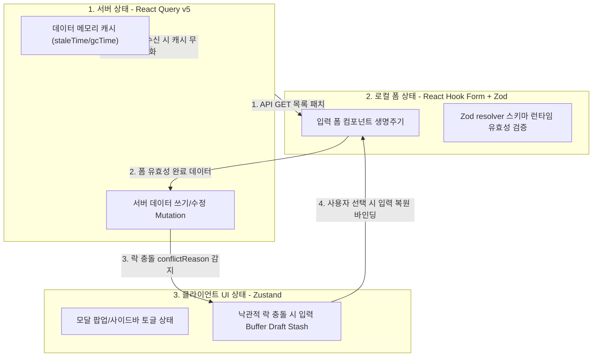

작성일: 2026년 7월 21일
작성자: PRODEV

## 1. 개요 및 설계 분리 배경
안녕하세요, **PROCPA**입니다.
이전 v1.1 프론트엔드 기술 명세서에 잔존하던 **window.onbeforeprint의 동기식 한계(await 미지원에 따른 비동기 인쇄 QR 누락 위험) 및 단순 조회 이력 캐싱의 맹점(오프라인 진입 시 미스캔 도면 검증 불가 오류)**은 브라우저 런타임 제약과 현장 음영 지역 인프라 한계를 감안하지 못한 치명적 기술 설계 구멍입니다.

브라우저 기본 인쇄 단축키(Ctrl+P) 전역 KeyDown 가로채기(Intercept) 무효화 및 자체 인쇄 함수 비동기 프로미스 락, 그리고 온라인 진입 시 전체 ACTIVE 도면 메타데이터 세트 백그라운드 프리패치(Pre-fetch) 및 암호화 기법을 완비한 **프론트엔드 기술 아키텍처 명세서(v1.2)**를 수립하여 제시합니다.

---

## 2. 상태 관리 삼원화 아키텍처 및 비주얼 다이어그램 (Three-Tier State Architecture)
애플리케이션 전역 상태의 역할과 생명주기를 3개 계층으로 완전히 분리하여 데이터 싱크 정합성을 확보합니다.

### 2.1. 삼원화 상태 구조 및 데이터 흐름 다이어그램


---

## 3. SSE 싱글톤 커넥션 및 커넥션 고갈 방어
브라우저 HTTP/1.1 규격 제한에 의한 동일 도메인당 최대 6개 SSE 연결 제한 및 커넥션 고갈(Connection Starvation)을 원천 차단하기 위해, 전역 싱글톤 EventSource 관리 클래스를 두고 이미터로 배분(Dispatch)하는 구조를 수립합니다.

---

## 4. 인쇄 제어 락 및 오프라인 암호 프리패치 구현 스펙 (보완 완료)

### 4.1. 브라우저 API 한계 극복: 단축키 Intercept 및 자체 비동기 인쇄 락
`window.onbeforeprint` 내에서 `await` 비동기 제어가 작동하지 않는 브라우저 네이티브 한계를 가로채기(Intercept) 기법으로 완전 우회 방어합니다.

```typescript
// 1. 브라우저 기본 인쇄 단축키 (Ctrl+P, Ctrl+Shift+P) 전역 가로채기 차단
window.addEventListener("keydown", (event) => {
  if ((event.ctrlKey || event.metaKey) && event.key.toLowerCase() === "p") {
    event.preventDefault(); // 기본 인쇄 브라우저 팝업 호출 강제 차단
    executeSecurePrintFlow(); // 자체 동기화 인쇄 함수 강제 라우팅
  }
});

// 2. 브라우저 마우스 우클릭 및 웹 컨텍스트 메뉴 인쇄 차단
window.addEventListener("contextmenu", (event) => {
  // 우클릭 기본 메뉴 노출을 제어하여 브라우저 기본 인쇄 동작 진입로 차단
});

// 3. 자체 인쇄 버튼 및 단축키 연동 비동기 프로미스 동기화 락 함수
async function executeSecurePrintFlow() {
  // Zustand 인쇄 대기 모달 개설 (사용자 화면 인터랙션 차단)
  usePrintStore.getState().setLoading(true);
  
  try {
    // 캔버스 QR코드, 1회용 토큰, kid, HMAC 보안 서명 강제 병합 드로잉 대기
    await renderSecureQROverlay(canvasRef.current);
    
    // 비동기 렌더링이 100% 종결(Promise.resolve)된 안전한 시점에 네이티브 인쇄 강제 호출
    window.print();
  } catch (error) {
    console.error("보안 서명 QR 합성 실패", error);
  } finally {
    usePrintStore.getState().setLoading(false);
  }
}
```

### 4.2. 오프라인 로컬 캐시 맹점 극복: 전체 ACTIVE 도면 메타데이터 프리패치 (Pre-fetch)
작업자가 음영 지역(지하 가공소 등)에 들어가 이전에 한 번도 스캔한 적 없는 신규 종이 도면의 QR코드를 찍었을 때 캐시 데이터가 존재하지 않아 `UNVERIFIED`에 빠지는 논리적 오류를 프리패치 기법으로 원천 방어합니다.

```typescript
// 1. 온라인 상태 복구 시 작동하는 프리패치 백그라운드 스케줄러
async function prefetchActiveDrawingsMetadata() {
  if (!navigator.onLine) return; // 오프라인 시 기각
  
  try {
    // 백엔드로부터 현재 유효한 전체 ACTIVE 도면의 보안 검증 키셋 다운로드
    // 응답 구성: { drawingIdHash: string, tokenHash: string, kid: string, lifecycleStatus: 'ACTIVE' }[]
    const activeMetas = await api.get("/api/v1/verify/prefetch-active-set");
    
    // 브라우저 IndexedDB (또는 LocalStorage)에 암호화하여 저장
    const encryptedData = encryptPayload(activeMetas);
    localStorage.setItem("DMS_PREFETCH_ACTIVE_SET", encryptedData);
    localStorage.setItem("DMS_PREFETCH_TS", Date.now().toString());
  } catch (error) {
    console.error("ACTIVE 도면 프리패치 실패", error);
  }
}

// 2. 오프라인 (/verify) 모바일 QR 스캔 시 유효성 판정 분기
function verifyDrawingOffline(scannedToken: string): VerificationResult {
  const encryptedSet = localStorage.getItem("DMS_PREFETCH_ACTIVE_SET");
  if (!encryptedSet) {
    return { status: 'UNVERIFIED', message: '오프라인 상태이며 로컬 프리패치 데이터가 존재하지 않습니다.' };
  }
  
  // 로컬 Web Crypto 복호화 수행
  const activeSet = decryptPayload(encryptedSet);
  
  // 스캔된 1회용 토큰 해시값을 프리패치된 활성 데이터 세트와 로컬 대조
  const matched = activeSet.find(item => item.tokenHash === hash(scannedToken));
  
  if (matched) {
    // 최종 동기화 경과 시간 계산
    const prefetchTs = parseInt(localStorage.getItem("DMS_PREFETCH_TS") || "0");
    const elapsedMinutes = Math.floor((Date.now() - prefetchTs) / 60000);
    
    return {
      status: 'VALID',
      lifecycleStatus: 'ACTIVE',
      elapsedMinutes: elapsedMinutes // UI단에서 분 단위 경과에 따라 Green/Yellow/Orange 다단계 격하 처리
    };
  }
  
  return { status: 'UNVERIFIED', message: '프리패치 데이터 내에 존재하지 않는 도면입니다.' };
}
```

---

## 5. OpenAPI-to-Zod 빌드 파이프라인 자동화 (Code Generation)
백엔드 DDL의 필드 크기나 제약 조건 변경이 프론트의 Zod 폼 유효성 스키마와 불일치하여 발생하는 API 기각 오류를 Vite 빌드 스크립트 기반 `openapi-to-zod` 파이프라인으로 완전 자동화합니다.

---

## 6. 마치며 및 결론
본 프론트엔드 기술 아키텍처 명세서(v1.2)에서는 **window.onbeforeprint의 한계를 Keydown Key Intercept 우회 인쇄 기법으로 돌파**하고, **음영 지역에서의 오프라인 한계를 전체 ACTIVE 도면 메타데이터 백그라운드 프리패치(Pre-fetch) IndexedDB 이식**을 통해 영구 해결하였습니다.

이로써 현장 인프라 장비 한계와 브라우저 표준 한계 하에서도 오작동 없이 100% 무결 가동되는 기술 규격을 최종 수립 완료했습니다. 사양을 확인해 보시고 의견을 나누어 주십시오. 감사합니다.
