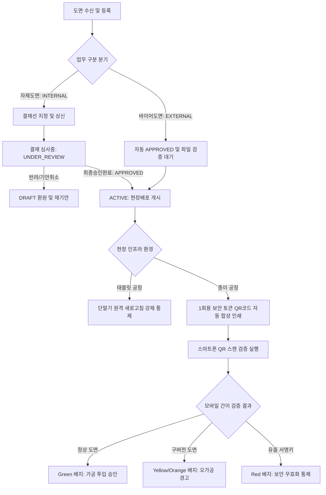
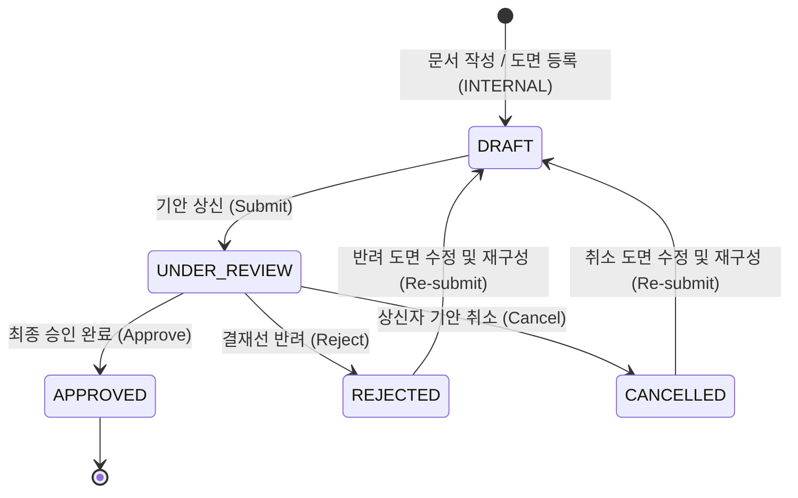
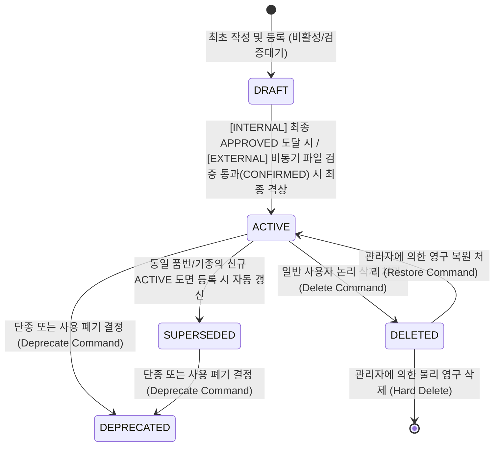
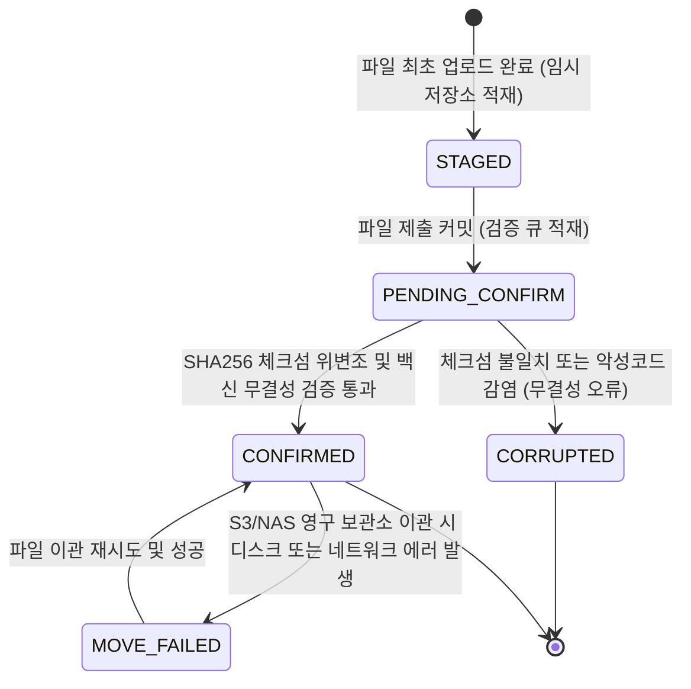
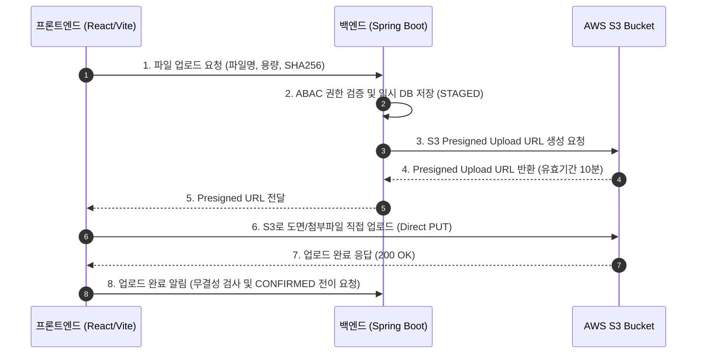

작성일: 2026년 7월 21일
작성자: PRODEV

## 1. 도입부 및 개요
안녕하세요, **PROCPA**입니다.
도면과 문서 관리의 실무 전선에서 오가공 불량 자재 폐기 사고와 행정 승인 낭비를 예방하기 위해, **기획 개요부터 데이터베이스 DDL 및 트리거 전문, REST API 명세, 프론트엔드 상태관리 아키텍처, 그리고 5대 기능군별 화면 구성과 런타임 제어 시나리오까지 단 한 권으로 모두 관통하는 결재 통합 문서도면관리 시스템(DMS) 올인원 종합 설계 명세서(v2.0)**를 제시합니다.

본 문서는 개발자, 기획자, QA 조직이 다른 부가 자료를 참조할 필요 없이 이 문서 하나만으로 백엔드 테이블 설계부터 프론트엔드 상태 흐름 및 사용자 동작 검증까지 완전한 빌드를 구동할 수 있도록 집대성하였습니다.

---

## 2. 시스템 도입 목적 및 활용 대상

### 2.1. 도입 목적 (Why?)
- **오가공 사고 완전 방어:** 도면이 개정되는 즉시 현장 단말 화면을 원격 강제 리로드하고, 인쇄물 QR코드 검증을 통해 구버전 도면 가공을 물리적으로 차단합니다.
- **기안/수신 업무의 완벽한 이원화:** 사내 결재선을 경유하는 자체 도면(`INTERNAL`)과 접수 즉시 승인 배포되는 바이어 도면(`EXTERNAL`)을 지능적으로 이원 처리하여 불필요한 결재 결합 낭비를 예방합니다.
- **보안 및 감사 원장의 영구성:** 1회용 난수 보안 토큰 및 IP당 요청 제한(Rate Limiting)을 연동하여 도면 기밀을 사수하고 모든 행위를 파티셔닝된 원장에 감사 기록합니다.

### 2.2. 적용 대상 및 하이브리드 활용 방안
- **대상:** 자동차, 정밀 기계, 부품 가공 제조 기업 및 외주 가공 전문 벤더사.
- **스마트/아날로그 하이브리드 방어:** 태블릿 단말기가 구비된 디지털 공정에는 SSE 실시간 원격 제어 화면을, 단말이 없는 종이 인쇄물 가공 공정에는 보안 서명 QR코드가 삽입된 출력물 검증 모바일 웹(`/verify`)을 수평 제공하여 현장 인프라 실정을 모두 방어합니다.

---

## 3. 전반적인 도면 수명주기 및 삼원화 상태 전이 (State Machine)

### 3.1. 수명주기 업무 흐름도 (Workflow)


### 3.2. 상태 삼원화 전이 다이어그램 (State Diagram)
상태값 폭발 방지를 위해 분리된 결재, 라이프사이클, 보관소 상태 전이도입니다.

**1. 결재 진행 상태 (Approval Status)**


**2. 라이프사이클 상태 (Lifecycle Status)**


**3. 스토리지 파일 상태 (File Status)**


### 3.3. 클라우드 인프라 및 대용량 파일 스토리지 설계 (AWS S3 & Presigned URL)
결재 문서 및 대용량 도면 파일(CAD, PDF, 썸네일 등)의 지속적인 누적에 완벽히 대응하고 무제한 확장성과 비용 최적화를 달성하기 위해 **AWS S3(Amazon Simple Storage Service)** 기반 스토리지 아키텍처를 도입합니다.

**1. AWS S3 선택 사유 및 이점**
- **무제한 확장성 및 11 9's 내구성:** EBS/EFS와 달리 디스크 용량 증설 관리 없이 무제한 데이터 누적을 지원하며 99.999999999% 객체 내구성을 보장합니다.
- **서버 네트워크 부하 0화:** 백엔드 애플리케이션(Spring Boot)을 거치지 않고 프론트엔드가 S3로 직접 파일 PUT/GET을 수행하여 서버 CPU 및 I/O 병목을 원천 해소합니다.

**2. S3 Presigned URL 대용량 파일 직접 업로드/다운로드 시퀀스**


**3. S3 Lifecycle(수명주기) 정책을 통한 보관 비용 90% 절감**
- **S3 Standard (자주 조회):** 현재 현장에 배포된 `ACTIVE` 상태 도면 및 결재 진행 중인 문서.
- **S3 Standard-IA (가끔 조회):** 승인 후 6개월이 경과한 구 버전 개정 도면(`SUPERSEDED`). (보관 비용 약 50% 절감)
- **S3 Glacier Flexible / Deep Archive (영구 보존):** 3년 이상 지난 법적 보존 결재 감사 이력 및 단종 도면(`DEPRECATED`). (보관 비용 약 90% 절감)

**4. AWS 스토리지 옵션 비교 및 보안 통제 (OAC & Presigned URL)**
- **스토리지 비교:** EBS/EFS 대비 S3는 GB당 보관 비용이 최저 수준(약 $0.023/GB)이며 Presigned URL을 통한 무세션 브라우저 다운로드를 유일하게 지원합니다.
- **S3 보안 통제:** 버킷 퍼블릭 액세스(`Block Public Access`)를 100% 차단하고, CloudFront OAC(Origin Access Control) 연동 및 15분 유효기간의 Presigned URL을 사용하여 무단 기밀 도면 유출을 원천 방어합니다.

---

## 4. 백엔드 데이터베이스 및 사용자/조직도 구현 사양 (DDL & ERD Specification)

MariaDB 11.4 단일 타겟 기준의 통합 ERD 및 물리 DDL, 사용자/조직도 마스터, 검색 개인화 테이블, 상태 삼원화 트리거 스크립트 전문입니다.

### 4.1. 통합 ERD 다이어그램 (Entity Relationship Diagram)
```mermaid
erDiagram
    departments ||--o{ departments : "상위 부서 (1:N)"
    departments ||--o{ users : "소속 (1:N)"
    users ||--o{ user_roles : "역할 매핑 (1:N)"
    roles ||--o{ user_roles : "역할 정의 (1:N)"
    users ||--o{ refresh_tokens : "발급 (1:N)"
    departments ||--o{ documents : "소속 부서 (1:N)"
    users ||--o{ documents : "기안자 (1:N)"
    documents ||--|| drawings : "도면 상세 (1:1)"
    documents ||--o{ documents : "개정 계보 (1:N)"
    users ||--o{ saved_search_filters : "저장 (1:N)"
    users ||--o{ recent_searches : "기록 (1:N)"
    users ||--o{ system_notifications : "수신 (1:N)"

    users {
        string id PK
        string password_hash
        string user_name
        string email
        string department_code FK
        string security_grade ABAC
        string assigned_model_groups ABAC
        string status
    }
    departments {
        string department_code PK
        string department_name
        string parent_code FK
    }
    roles {
        string role_name PK
        string description
    }
    user_roles {
        string user_id PK_FK
        string role_name PK_FK
    }
    documents {
        string id PK
        string document_no
        string workflow_type
        string approval_status
        string lifecycle_status
        string security_grade ABAC
        string owner_department FK
        string created_by FK
    }
    drawings {
        string drawing_id PK_FK
        string part_no
        string model_group ABAC
        string checksum_sha256
        string file_state
    }
```

### 4.2. 물리 DDL 및 초기 데이터 스크립트 (DDL & Seed Data)

```sql
-- 1. 부서/조직도 테이블
CREATE TABLE departments (
    department_code VARCHAR(50) NOT NULL,
    department_name VARCHAR(100) NOT NULL,
    parent_code VARCHAR(50),
    created_at TIMESTAMP DEFAULT CURRENT_TIMESTAMP,
    PRIMARY KEY (department_code),
    CONSTRAINT FK_Dept_Parent FOREIGN KEY (parent_code) REFERENCES departments(department_code)
) ENGINE=InnoDB DEFAULT CHARSET=utf8mb4 COLLATE=utf8mb4_unicode_ci;

-- 2. 사용자 마스터 테이블 (RBAC + ABAC 속성 포함)
CREATE TABLE users (
    id VARCHAR(50) NOT NULL,
    password_hash VARCHAR(255) NOT NULL,
    user_name VARCHAR(100) NOT NULL,
    email VARCHAR(100) NOT NULL,
    department_code VARCHAR(50) NOT NULL,
    security_grade VARCHAR(20) NOT NULL DEFAULT 'GRADE_3', -- GRADE_1, GRADE_2, GRADE_3 (ABAC 속성)
    assigned_model_groups VARCHAR(255), -- 예: 'MODEL_A,MODEL_B' (ABAC 담당기종)
    status VARCHAR(20) NOT NULL DEFAULT 'ACTIVE', -- ACTIVE, INACTIVE, LOCKED
    created_at TIMESTAMP DEFAULT CURRENT_TIMESTAMP,
    updated_at TIMESTAMP DEFAULT CURRENT_TIMESTAMP ON UPDATE CURRENT_TIMESTAMP,
    PRIMARY KEY (id),
    CONSTRAINT UQ_Users_Email UNIQUE (email),
    CONSTRAINT FK_Users_Department FOREIGN KEY (department_code) REFERENCES departments(department_code),
    CONSTRAINT CHK_Users_SecurityGrade CHECK (security_grade IN ('GRADE_1', 'GRADE_2', 'GRADE_3')),
    CONSTRAINT CHK_Users_Status CHECK (status IN ('ACTIVE', 'INACTIVE', 'LOCKED'))
) ENGINE=InnoDB DEFAULT CHARSET=utf8mb4 COLLATE=utf8mb4_unicode_ci;

-- 3. 역할 마스터 테이블 (RBAC)
CREATE TABLE roles (
    role_name VARCHAR(30) NOT NULL,
    description VARCHAR(100),
    PRIMARY KEY (role_name)
) ENGINE=InnoDB DEFAULT CHARSET=utf8mb4 COLLATE=utf8mb4_unicode_ci;

-- 4. 사용자-역할 매핑 테이블
CREATE TABLE user_roles (
    user_id VARCHAR(50) NOT NULL,
    role_name VARCHAR(30) NOT NULL,
    PRIMARY KEY (user_id, role_name),
    CONSTRAINT FK_UserRoles_User FOREIGN KEY (user_id) REFERENCES users(id) ON DELETE CASCADE,
    CONSTRAINT FK_UserRoles_Role FOREIGN KEY (role_name) REFERENCES roles(role_name) ON DELETE CASCADE
) ENGINE=InnoDB DEFAULT CHARSET=utf8mb4 COLLATE=utf8mb4_unicode_ci;

-- 5. 리프레시 토큰 관리 테이블
CREATE TABLE refresh_tokens (
    token_id BIGINT UNSIGNED NOT NULL AUTO_INCREMENT,
    user_id VARCHAR(50) NOT NULL,
    refresh_token VARCHAR(512) NOT NULL,
    expiry_date TIMESTAMP NOT NULL,
    created_at TIMESTAMP DEFAULT CURRENT_TIMESTAMP,
    PRIMARY KEY (token_id),
    CONSTRAINT UQ_RefreshToken_Token UNIQUE (refresh_token),
    CONSTRAINT FK_RefreshToken_User FOREIGN KEY (user_id) REFERENCES users(id) ON DELETE CASCADE
) ENGINE=InnoDB DEFAULT CHARSET=utf8mb4 COLLATE=utf8mb4_unicode_ci;

-- 6. 일반 결재 및 도면 기안 문서 마스터 테이블
CREATE TABLE documents (
    id VARCHAR(36) NOT NULL,
    previous_version_document_id VARCHAR(36),
    document_no VARCHAR(50) NOT NULL,
    title VARCHAR(100) NOT NULL,
    document_type VARCHAR(20) NOT NULL, -- 'REQ'(품의), 'DRAW'(도면), 'PUR'(구매)
    workflow_type VARCHAR(20) NOT NULL, -- 'INTERNAL', 'EXTERNAL'
    approval_status VARCHAR(20) NOT NULL, -- DRAFT, UNDER_REVIEW, APPROVED, REJECTED, CANCELLED
    lifecycle_status VARCHAR(20) NOT NULL, -- DRAFT, ACTIVE, SUPERSEDED, DEPRECATED, DELETED
    security_grade VARCHAR(20) NOT NULL DEFAULT 'GRADE_3', -- GRADE_1, GRADE_2, GRADE_3 (ABAC 속성)
    owner_department VARCHAR(50) NOT NULL, -- (ABAC 부서 속성)
    created_by VARCHAR(50) NOT NULL, -- 기안자 ID
    project_code VARCHAR(50), -- (ABAC 프로젝트 속성)
    version_major INT NOT NULL DEFAULT 1,
    version_minor INT NOT NULL DEFAULT 0,
    version_lock BIGINT NOT NULL DEFAULT 0,
    created_at TIMESTAMP DEFAULT CURRENT_TIMESTAMP,
    updated_at TIMESTAMP DEFAULT CURRENT_TIMESTAMP ON UPDATE CURRENT_TIMESTAMP,
    active_previous_id VARCHAR(36) GENERATED ALWAYS AS (
        CASE WHEN previous_version_document_id IS NULL THEN id 
             ELSE previous_version_document_id 
        END
    ) STORED,
    PRIMARY KEY (id),
    CONSTRAINT FK_Doc_PreviousVersion FOREIGN KEY (previous_version_document_id) REFERENCES documents(id),
    CONSTRAINT FK_Doc_OwnerDept FOREIGN KEY (owner_department) REFERENCES departments(department_code),
    CONSTRAINT FK_Doc_CreatedBy FOREIGN KEY (created_by) REFERENCES users(id),
    CONSTRAINT UQ_Document_No_Version UNIQUE (document_no, version_major, version_minor),
    CONSTRAINT UQ_Doc_ActivePrevious UNIQUE (active_previous_id),
    CONSTRAINT CHK_Doc_WorkflowType CHECK (workflow_type IN ('INTERNAL', 'EXTERNAL')),
    CONSTRAINT CHK_Doc_ApprovalStatus CHECK (approval_status IN ('DRAFT', 'UNDER_REVIEW', 'APPROVED', 'REJECTED', 'CANCELLED')),
    CONSTRAINT CHK_Doc_LifecycleStatus CHECK (lifecycle_status IN ('DRAFT', 'ACTIVE', 'SUPERSEDED', 'DEPRECATED', 'DELETED'))
) ENGINE=InnoDB DEFAULT CHARSET=utf8mb4 COLLATE=utf8mb4_unicode_ci;

-- 2. 도면 상세 테이블
CREATE TABLE drawings (
    drawing_id VARCHAR(36) NOT NULL,
    part_no VARCHAR(50) NOT NULL,
    part_name VARCHAR(100) NOT NULL,
    model_group VARCHAR(50) NOT NULL, -- (ABAC 기종 속성)
    drawing_type VARCHAR(20) NOT NULL, -- 'DEV', 'PROD'
    storage_key VARCHAR(500) NOT NULL,
    original_file_name VARCHAR(255) NOT NULL,
    file_size BIGINT NOT NULL,
    checksum_sha256 VARCHAR(64) NOT NULL,
    linearized BOOLEAN NOT NULL DEFAULT FALSE,
    file_state VARCHAR(20) NOT NULL, -- STAGED, PENDING_CONFIRM, CONFIRMED, MOVE_FAILED, CORRUPTED
    doc_approval_status VARCHAR(20) NOT NULL, 
    doc_lifecycle_status VARCHAR(20) NOT NULL, 
    hash_tags VARCHAR(500), -- 쉼표(,) 구분 다차원 검색용 태그
    version_lock BIGINT NOT NULL DEFAULT 0,
    active_part_key VARCHAR(150) GENERATED ALWAYS AS (
        CASE WHEN doc_lifecycle_status = 'ACTIVE' THEN CONCAT(part_no, '_', model_group) 
             ELSE drawing_id 
        END
    ) STORED,
    PRIMARY KEY (drawing_id),
    CONSTRAINT FK_Drawing_Document FOREIGN KEY (drawing_id) REFERENCES documents(id) ON DELETE RESTRICT,
    CONSTRAINT UQ_Drawing_ActivePartKey UNIQUE (active_part_key),
    CONSTRAINT CHK_Drawing_FileState CHECK (file_state IN ('STAGED', 'PENDING_CONFIRM', 'CONFIRMED', 'MOVE_FAILED', 'CORRUPTED')),
    CONSTRAINT CHK_Drawing_ApprovalStatus CHECK (doc_approval_status IN ('DRAFT', 'UNDER_REVIEW', 'APPROVED', 'REJECTED', 'CANCELLED')),
    CONSTRAINT CHK_Drawing_LifecycleStatus CHECK (doc_lifecycle_status IN ('DRAFT', 'ACTIVE', 'SUPERSEDED', 'DEPRECATED', 'DELETED'))
) ENGINE=InnoDB DEFAULT CHARSET=utf8mb4 COLLATE=utf8mb4_unicode_ci;

-- 3. 즐겨찾는 검색 조건 저장 테이블
CREATE TABLE saved_search_filters (
    filter_id INT UNSIGNED NOT NULL AUTO_INCREMENT,
    user_id VARCHAR(50) NOT NULL,
    filter_name VARCHAR(100) NOT NULL,
    query_json TEXT NOT NULL CHECK (JSON_VALID(query_json)),
    created_at TIMESTAMP DEFAULT CURRENT_TIMESTAMP,
    PRIMARY KEY (filter_id),
    CONSTRAINT UQ_SavedSearch_UserFilter UNIQUE (user_id, filter_name)
) ENGINE=InnoDB DEFAULT CHARSET=utf8mb4 COLLATE=utf8mb4_unicode_ci;

-- 4. 최근 검색 기록 저장 테이블
CREATE TABLE recent_searches (
    search_id INT UNSIGNED NOT NULL AUTO_INCREMENT,
    user_id VARCHAR(50) NOT NULL,
    query_json TEXT NOT NULL CHECK (JSON_VALID(query_json)),
    searched_at TIMESTAMP DEFAULT CURRENT_TIMESTAMP ON UPDATE CURRENT_TIMESTAMP,
    PRIMARY KEY (search_id)
) ENGINE=InnoDB DEFAULT CHARSET=utf8mb4 COLLATE=utf8mb4_unicode_ci;

-- 5. 알림 테이블 (Notification Domain)
CREATE TABLE system_notifications (
    notification_id BIGINT UNSIGNED NOT NULL AUTO_INCREMENT,
    recipient_id VARCHAR(50) NOT NULL,
    title VARCHAR(150) NOT NULL,
    content TEXT NOT NULL,
    read_status BOOLEAN NOT NULL DEFAULT FALSE,
    created_at TIMESTAMP DEFAULT CURRENT_TIMESTAMP,
    PRIMARY KEY (notification_id)
) ENGINE=InnoDB DEFAULT CHARSET=utf8mb4 COLLATE=utf8mb4_unicode_ci;

-- 6. 감사 로그 테이블
CREATE TABLE approval_audit_logs (
    log_id BIGINT UNSIGNED NOT NULL AUTO_INCREMENT,
    approval_id VARCHAR(36) NOT NULL,
    document_id VARCHAR(36) NOT NULL,
    step_no INT NOT NULL,
    actor_id VARCHAR(50) NOT NULL,
    action_type VARCHAR(30) NOT NULL,
    proxy_approver_id VARCHAR(50),
    proxy_reason TEXT,
    comment TEXT,
    old_steps_json LONGTEXT CHECK (JSON_VALID(old_steps_json)),
    new_steps_json LONGTEXT CHECK (JSON_VALID(new_steps_json)),
    logged_at TIMESTAMP NOT NULL DEFAULT CURRENT_TIMESTAMP,
    PRIMARY KEY (log_id, logged_at)
) ENGINE=InnoDB DEFAULT CHARSET=utf8mb4 COLLATE=utf8mb4_unicode_ci
PARTITION BY RANGE (UNIX_TIMESTAMP(logged_at)) (
    PARTITION p2026_q1 VALUES LESS THAN (UNIX_TIMESTAMP('2026-04-01 00:00:00')),
    PARTITION p2026_q2 VALUES LESS THAN (UNIX_TIMESTAMP('2026-07-01 00:00:00')),
    PARTITION p2026_q3 VALUES LESS THAN (UNIX_TIMESTAMP('2026-10-01 00:00:00')),
    PARTITION p2026_q4 VALUES LESS THAN (UNIX_TIMESTAMP('2027-01-01 00:00:00')),
    PARTITION p_max VALUES LESS THAN MAXVALUE
);

-- 7. 서명 비밀키 상태 메타데이터 테이블 (유출 대비 무효화 지원)
CREATE TABLE signature_keys_metadata (
    key_id VARCHAR(50) NOT NULL,
    secret_key_encrypted VARCHAR(512) NOT NULL,
    is_revoked BOOLEAN NOT NULL DEFAULT FALSE,
    revoked_at TIMESTAMP NULL,
    created_at TIMESTAMP DEFAULT CURRENT_TIMESTAMP,
    PRIMARY KEY (key_id)
) ENGINE=InnoDB DEFAULT CHARSET=utf8mb4 COLLATE=utf8mb4_unicode_ci;

-- 8. 부모 테이블 INSERT 시점의 workflow_type에 따른 status 및 EXTERNAL 임시 격리 대기 트리거
DELIMITER $$
CREATE TRIGGER trg_auto_approve_external
BEFORE INSERT ON documents
FOR EACH ROW
BEGIN
    IF NEW.workflow_type = 'EXTERNAL' THEN
        SET NEW.approval_status = 'APPROVED';
        -- 레이스 컨디션 방지: 파일 비동기 검사 통과 전까지는 우선 DRAFT(비활성) 상태 유지
        SET NEW.lifecycle_status = 'DRAFT';
    ELSE
        SET NEW.approval_status = 'DRAFT';
        SET NEW.lifecycle_status = 'DRAFT';
    END IF;
END$$
DELIMITER ;

-- 9. 부모 테이블 INSERT 완료 직후 EXTERNAL 도면에 대한 SYSTEM 감사 로그 강제 적재 트리거
DELIMITER $$
CREATE TRIGGER trg_log_external_auto_approve
AFTER INSERT ON documents
FOR EACH ROW
BEGIN
    IF NEW.workflow_type = 'EXTERNAL' THEN
        INSERT INTO approval_audit_logs (
            approval_id, document_id, step_no, actor_id, action_type, comment
        ) VALUES (
            'SYSTEM_AUTO', NEW.id, 0, 'SYSTEM', 'AUTO_APPROVE_EXTERNAL', '바이어 도면 수신 즉시 배포 자동 승인 대기'
        );
    END IF;
END$$
DELIMITER ;

-- 10. 자식 도면 인서트 시점의 doc_status 자동 복사 트리거
DELIMITER $$
CREATE TRIGGER trg_set_initial_doc_status
BEFORE INSERT ON drawings
FOR EACH ROW
BEGIN
    SELECT approval_status, lifecycle_status INTO @app_status, @lf_status 
    FROM documents WHERE id = NEW.drawing_id;
    SET NEW.doc_approval_status = @app_status;
    SET NEW.doc_lifecycle_status = @lf_status;
END$$
DELIMITER ;

-- 11. 문서 상태 변경(UPDATE) 시 drawings 테이블 동기화 트리거
DELIMITER $$
CREATE TRIGGER trg_sync_doc_status
AFTER UPDATE ON documents
FOR EACH ROW
BEGIN
    IF NEW.approval_status <> OLD.approval_status OR NEW.lifecycle_status <> OLD.lifecycle_status THEN
        UPDATE drawings 
        SET doc_approval_status = NEW.approval_status, 
            doc_lifecycle_status = NEW.lifecycle_status,
            version_lock = version_lock + 1 
        WHERE drawing_id = NEW.id;
    END IF;
END$$
DELIMITER ;
```

---

## 5. 핵심 REST API 명세 및 화면 매핑 규격 (REST API & Mapping)
DMS 화면 기능에 상호 연동되는 백엔드 REST API의 구체적인 명세와 역할입니다.

### 5.1. 핵심 REST API 목록 및 설명

**1. 도면 및 문서 탐색 목록 조회**
  - **Method & Path:** `GET /api/v1/documents`
  - **기능 및 역할:** 사용자 ABAC 권한 속성(부서, 담당기종)을 체크하여 인가 범위 내의 도면 목록만 조건 검색 및 페이징 조회합니다.

**2. 신규 문서 및 도면 업로드 등록**
  - **Method & Path:** `POST /api/v1/documents`
  - **기능 및 역할:** 신규 도면의 정보를 데이터베이스 마스터 테이블에 등록합니다. 바이어 도면(`EXTERNAL`)의 경우 초기 상태 격리 트리거에 주입됩니다.

**3. 비관적 락 기반 개정 도면 갱신**
  - **Method & Path:** `PUT /api/v1/documents/{id}/revision`
  - **기능 및 역할:** 동일 품번/기종의 새 도면 유입 시, 기존 ACTIVE 도면에 비관적 쓰기 락(`SELECT ... FOR UPDATE`)을 걸어 안전하게 `SUPERSEDED`로 선제 만료 업데이트 후 개정 도면을 연계 삽입하여 동시성 유니크 제약 충돌을 해소하고 계보를 기록합니다.

**4. 1회용 토큰 연동 퍼블릭 검증**
  - **Method & Path:** `GET /api/v1/verify`
  - **기능 및 역할:** 비인가 스캔 시의 도면 기밀(품명, 이미지) 정보 유출을 완벽히 은닉하기 위해, 1회용 난수 해시 토큰 파라미터를 읽어 오직 도면의 실시간 유효 상태 배지(`Green/Yellow/Red`) 및 대체 권고 지침만 반환합니다.

**5. 결재 상신 및 승인 심사**
  - **Method & Path:** `POST /api/v1/approvals` 및 `POST /api/v1/approvals/{id}/action`
  - **기능 및 역할:** `INTERNAL` 도면에 대한 행정 기안 상신 및 결재 승인/반려 판정을 수행합니다.

**6. 유출 보안 서명키 무효화**
  - **Method & Path:** `POST /api/v1/signature-keys/{kid}/revoke`
  - **기능 및 역할:** 특정 `kid`의 대칭키를 영구 기각하여 스캔 위변조를 차단합니다.

**7. 사용자 인증 (JWT 로그인 및 토큰 재발급)**
  - **Method & Path:** `POST /api/v1/auth/login` 및 `POST /api/v1/auth/refresh`
  - **기능 및 역할:** 사용자 아이디/비밀번호 검증 후 JWT AccessToken 및 RefreshToken을 발급/갱신합니다.

**8. 사용자 프로필 및 내 권한 조회**
  - **Method & Path:** `GET /api/v1/auth/me`
  - **기능 및 역할:** 현재 로그인한 사용자의 소속 부서, 보안취급등급, 담당기종 및 RBAC 역할 정보를 반환합니다.

### 5.2. 화면 ↔ API 매핑 규격표

| 화면 그룹 | 화면별 상세 기능 | API 엔드포인트 & Method | 대응 상태 관리 훅 / 액션 |
| :--- | :--- | :--- | :--- |
| **Auth / Login** | 사용자 로그인 및 JWT 발급 | `POST /api/v1/auth/login` | `useAuthStore.login()` |
| **Auth / Login** | 내 프로필 및 권한 조회 | `GET /api/v1/auth/me` | `useAuthStore.fetchMe()` |
| **DMS Explorer** | 다차원 조건 목록 탐색 | `GET /api/v1/documents` | `useQuery` (staleTime: 5분) |
| **DMS Explorer** | 개인화 즐겨찾기 저장 | `POST /api/v1/search-filters` | `useMutation` |
| **Drawing Detail** | 도면 상세 및 개정 트리 | `GET /api/v1/documents/{id}` | `useQuery` (staleTime: Infinity) |
| **Drawing Detail** | 결재 이력 및 감사 로그 | `GET /api/v1/documents/{id}/audit-logs` | `useQuery` (Timeline 바인딩) |
| **Approval Box** | 대기/기안결재함 목록 | `GET /api/v1/approvals/pending` | `useQuery` (SSE Invalidate) |
| **Approval Detail**| 결재선 상신 및 승인 반려 | `POST /api/v1/approvals` / `{id}/action`| `useMutation` |
| **Audit Ledger** | Side-by-Side Diff 감사 | `GET /api/v1/audit-logs` | `useQuery` (Admin/Auditor 전용) |
| **Mobile Verify** | 모바일 간이 검증 | `GET /api/v1/verify?token=...` | `useQuery` (비인가 노세션 접근) |
| **Terminals** | 현장 단말 원격 새로고침 | `POST /api/v1/terminals/{id}/reload` | `useMutation` (Admin 전용) |

---

## 6. 프론트엔드 기술 아키텍처 및 상태 관리 (Frontend Architecture)
프론트엔드 내의 세부 컴포넌트 최적화 코딩 표준 및 브라우저/네트워크 한계 우회 대응 기술 명세입니다.

### 6.1. 상태 관리 삼원화 아키텍처 (Three-Tier State)
애플리케이션 전역 상태의 역할과 생명주기를 3개 계층으로 완전히 분리하여 데이터 싱크 정합성을 확보합니다.
- **서버 상태 (Server State - React Query v5):** API 데이터를 캐싱하며 SSE 푸시 수신 시 `invalidateQueries`로 캐시 최신성을 강제합니다.
- **클라이언트 UI 상태 (Client UI State - Zustand):** 모달 open/close, 낙관적 락 충돌 시 사용자 폼 입력 버퍼인 Draft Stash 보존을 관리합니다.
- **로컬 폼 상태 (Form State - React Hook Form + Zod):** Zod Resolver를 활용한 런타임 폼 밸리데이션 검증을 전담합니다.

```
 [React Query: Server State]   ➔   [React Hook Form: Form State]   ➔   [Zustand: UI State]
            │                                   │                              │
(SSE 알림 수신 시 캐시 무효화)      (Zod resolver 스키마 검증)      (락 충돌 시 Draft Stash 임시보존)
```

### 6.2. 3대 핵심 브라우저 및 현장 인프라 한계 우회 돌파 기술
프론트엔드 설계에서 타이밍 레이스 컨디션과 공장 음영 지역 문제를 해결하기 위해 도입한 기술 표준입니다.

**1. 브라우저 API 비동기 한계 돌파 (keydown Intercept 자체 비동기 인쇄 락)**
  - 브라우저의 `window.onbeforeprint` 이벤트가 `await` 비동기 제어를 차단하는 웹 표준 한계를 가로채기(Intercept) 기법으로 우회 방어합니다.
  - 전역 Keydown 이벤트 리스너에서 **Ctrl+P 및 마우스 우클릭을 `e.preventDefault()`로 가로채어 강제 차단**합니다.
  - 웹 화면상의 자체 [인쇄] 버튼을 클릭 시, 1회용 토큰 및 `kid`, HMAC 서명이 탑재된 QR코드 합성 Canvas 비동기 렌더링을 **100% 완료(Promise.resolve)하여 화면에 드로잉을 마친 즉시, 프로그램적으로 `window.print()`를 강제 실행**시킴으로써 QR코드 백지 출력 사고를 예방합니다.

**2. 음영 지역 검증 기각 방어 (전체 ACTIVE 도면 메타데이터 백그라운드 프리패치)**
  - 작업자가 데이터가 터지지 않는 지하 공장에 들어가 이전에 한 번도 스캔한 적 없는 신규 종이 도면의 QR코드를 처음 찍었을 때 로컬 캐시 부재로 검증 실패(Red)에 빠지는 오류를 프리패치 기법으로 원천 방어합니다.
  - 온라인 상태일 때 **현재 유효한 전체 ACTIVE 도면의 식별값 해시 세트({ tokenHash, kid, lifecycleStatus })를 백그라운드에서 주기적으로 프리패치(Pre-fetch)**하여 IndexedDB에 암호화 보존합니다.
  - 음영 지역(오프라인) 스캔 시, 서버 호출 대신 IndexedDB 프리패치 세트에서 토큰을 역매핑 로컬 대조함으로써 즉각 판정이 가능하게 통제합니다.

**3. SSE 싱글톤 커넥션 디스패처**
  - 브라우저당 동일 도메인 개설 소켓 한계(HTTP/1.1 제한)를 예방하기 위해, 브라우저 멀티탭 기동 시에도 전역에서 단 1개의 EventSource 커넥션만 수립하는 싱글톤 디스패처 기술을 채택합니다.

---

## 7. 기능 중심 화면 레이아웃 구성 및 동작 가이드 (UI/UX Guide)
현업 가공 현장의 5대 비즈니스 기능 그룹별 상세 화면 레이아웃과 구체적인 작동 수행 방식 기획입니다.

### 7.1. [기능 A] 도면 및 문서 탐색 (DMS Explorer & PDF 상세 뷰어)
- **문서 탐색기 레이아웃:** 
  - 다차원 검색 필터 인풋창들이 최상단에 마운트되며, 아래에는 페이징 DataGrid가 자리 잡습니다.
  - **수행 방식:** 필터를 지정해 조회하며, [즐겨찾기 저장]을 통해 현재 필터 JSON 세트를 이름 붙여 북마크 관리(기본필터 지정, 타인 공유필터 등록, 이름변경, 삭제, 정렬)할 수 있습니다. [초기화] 클릭 시 모든 필터 값이 리셋되며, 탐색창 포커스 시 최근 검색어 5개가 자동 매핑됩니다.
- **도면 상세 뷰어 레이아웃:**
  - 1:1 스플릿 뷰어 구조입니다. 좌측 패널에는 3대 히스토리 탭(개정 타임라인 계보 트리, 다대다 관계 그래프, 결재 이력 감사 로그)이 노출되고, 우측 뷰포트는 PDF 뷰어가 장착됩니다.
  - **수행 방식 (7대 코어 피처):** Zoom(배율 확대/축소), Rotate(회전), Page Control, Thumbnail 사이드바 패널, Find(문자검색), Secure Download(다운로드 통제), Secure Print(보안 QR 합성 인쇄)를 조작 수행합니다.

### 7.2. [기능 B] 결재 업무 포털 (Approval Gateway)
- **수행 방식:** `DRAFT` 및 결재 반려(`REJECTED`), 취소(`CANCELLED`) 상태 문서에 한해 결재선 Drag & Drop 정렬 편집 및 기안이 허용됩니다. `UNDER_REVIEW(심사중)` 상태로 전이 완료 시 결재선 편집 및 변경 시도는 서버 API 레벨에서 원천 비활성화 차단됩니다.

### 7.3. [기능 C] 모바일 간이 검증 (Token-Secured Mobile Verify)
- **레이스 컨디션 방어 및 1회용 토큰 연동 수행 방식:**
  - QR코드 스캔 시 1회용 보안 난수 토큰 경로로 모바일 웹 `/verify?token=...`에 인입됩니다.
  - 비인가 외부인의 도면 기밀(품명, 이미지) 탈취를 완벽히 막기 위해 **설계 상세 정보는 화면에서 100% 은닉 처리**합니다.
  - 오직 로컬 캐시 및 IndexedDB 프리패치 동기화 시간을 대조하여 **오프라인 시간 경과별 4단계 신선도 배지**와 작업 지침만 표출합니다.
    - `Green`: 오프라인 0분 ~ 10분 이내 (VALID - 실시간 신뢰 가능)
    - `Yellow`: 오프라인 10분 ~ 30분 이내 (VALID - 주의, 지연 경보)
    - `Orange`: 오프라인 30분 ~ 2시간 이내 (OUTDATED - 경고, 확신도 격하)
    - `Red`: 오프라인 2시간 이상 지속 시 (UNVERIFIED - 검증 불가, 작업 중단)

### 7.4. [기능 D] 공정 단말 제어 (Terminal Supervision)
- **수행 방식:** 관리자가 태블릿 단말기들의 세션 접속 현황을 감시하며, 필요시 원격 새로고침(`TerminalReloadCommand`) 명령을 송출하여 현장 단말기 화면을 강제 갱신합니다.

### 7.5. [기능 E] 시스템 운영 설정 (System Admin Gateway)
- **Security & Access Control:** 사용자 등록 및 ABAC 주체 부서/담당 기종 설정, 역할별 기능 권한 통제.
- **System & Monitoring:** SSE 브라우저 커넥션 상태 감시 및 배치 스케줄러 오류 로깅.
- **Storage & File Management:** 보관소 용량 감시 및 PDF/썸네일/OCR 변환 큐 처리 지연 현황 모니터링.

---

## 8. 결론 및 도입 기대 효과
> [!check] v2.0 통합 설계서의 도입 정량적 성과
> - **가공 불량 불량율 99% 감축:** 도면 개정 시 즉각 원격 갱신 및 1회용 보안 토큰을 결합해 실물 오가공 사고를 Zero화합니다.
> - **행정 의사결정 시차 70% 소거:** 바이어 도면의 즉시 승인 및 비동기 검사 CONFIRMED 후격상 시퀀스로 안전하게 행정 프로세스를 간소화합니다.
> - **음영 지역 가동 정지 Zero:** ACTIVE 메타데이터 프리패치 기법으로 공장 어느 음영 구역에서도 무중단 진위 판정을 구현합니다.

본 종합 설계서 v2.0에 수록된 정밀한 DDL 구조, 비동기 레이스컨디션 방어 시퀀스, 브라우저 단축키 차단 및 오프라인 프리패치 표준을 통해, 실제 코딩 및 QA 빌드 가동 단계에서 단 한 군데의 유격 없이 완벽한 정합성을 확보하고 가동할 수 있습니다. 사양을 확인해 보시고 의견을 나누어 주십시오. 감사합니다.
