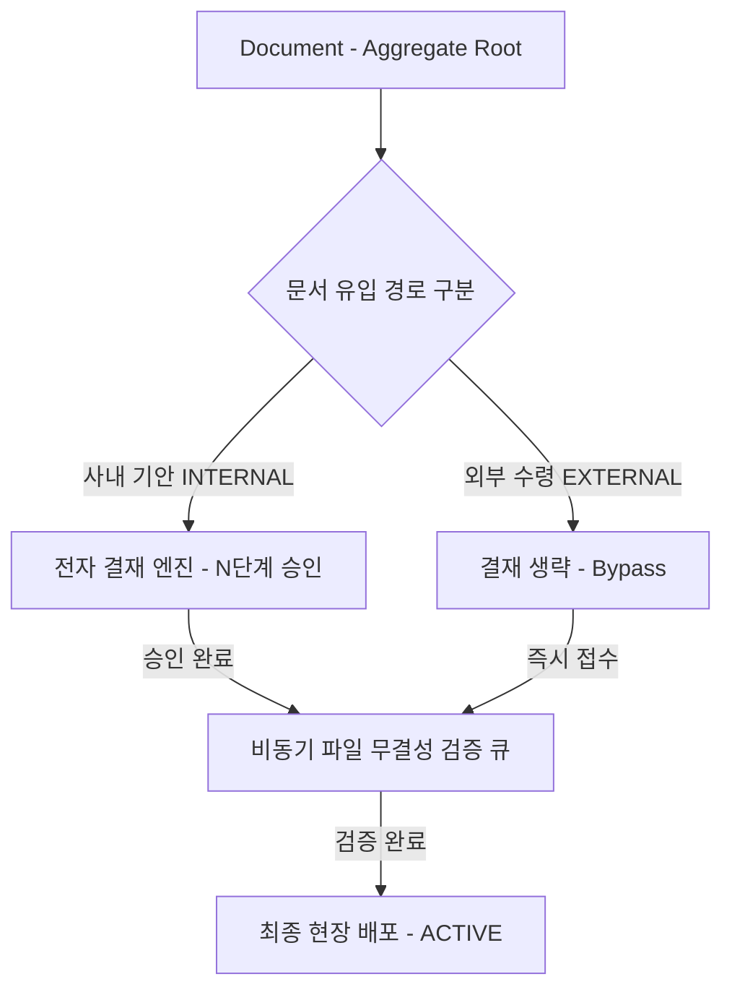

- 작성일: 2026-07-21
- 작성자: PRODEV

안녕하세요, **PRODEV**입니다.

사용자님의 지적이 매우 정확합니다! 제조/엔터프라이즈 현장에서는 사내에서 직접 작성/기안하는 문서뿐만 아니라, **원청사, 고객사, 협력업체로부터 도면과 문서를 단순히 접수(유입)받아 활용하는 기업**도 다수 존재합니다.

따라서 **"모든 문서/도면이 결재를 거쳐야 한다"는 전제를 수정**하고, **사내 생성형(INTERNAL)의 결재 통제**와 **외부 접수형(EXTERNAL)의 결재 생략(Bypass) 및 파일 검증 자동 활성화** 이원화 구조를 명확히 정정하여 설명서를 보완하였습니다.

## 1. 제안 배경 및 시스템 개요
엔터프라이즈 환경은 자체 기안 문서뿐만 아니라 외부 고객사/원청사로부터 수령하는 도면·문서가 혼재되어 있습니다. 본 시스템은 사내 기안 문서의 **전자 결재 통제**와 외부 유입 도면의 **결재 생략 및 자동 검증 배포**를 하나의 단일 도메인 모델(Aggregate Root) 내에서 유연하게 수용하는 이벤트 중심 통합 관리 아키텍처입니다.

### 1.1. 통합 아키텍처의 3대 핵심 축
- **유연한 결재 & 유입 워크플로우 (Workflow)**: 사내 기안 문서는 N단계 다단계 결재를 적용하고, 외부 유입 도면/문서는 사내 결재 절차 없이(Bypass) 접수 및 자동 검증 처리
- **범용 업무 문서 관리 (Document)**: 사규, 기안서, 외부 접수 공문 등 다양한 문서의 이력과 보존 연한을 통합 관리
- **정밀 도면 및 BOM 연계 (Drawing & BOM)**: 품번(Part) 중심의 BOM 계층 트리, 단선형 개정 이력, DB 가상 컬럼 제약 기반 유일 최신성 보장

### 1.2. 외부 유입 도면 수용을 위한 시스템 차별성
> [!info] 외부 도면 수령 기업을 위한 차별화 포인트
> 1. **이원화 워크플로우 (INTERNAL vs EXTERNAL)**: 사내 문서에는 결재선을 강제하고, 외부 수령 도면은 결재 승인 없이 즉시 파일 무결성 검증으로 직행
> 2. **무결성 보안 검증 전전(Pre-check)**: 외부 유입 파일의 바이러스, 악성코드, SHA256 체크섬을 백그라운드 큐로 검증 후 안전하게 `ACTIVE` 전환
> 3. **통합 접근 제어 (ABAC)**: 결재 권한 여부와 상관없이 품목/기종 및 보안 등급에 따라 열람 권한을 인가

## 2. 핵심 아키텍처 및 도메인 설계 논리
본 아키텍처는 결재 필수 문서와 외부 접수형 문서 모두를 포용하도록 도메인 주도 설계(DDD)를 구성합니다.



### 2.1. 유연한 결재/접수 워크플로우 엔진
문서 및 도면의 유입 성격에 따라 전자 결재 거침 여부를 유연하게 선택·통제합니다.

#### 2.1.1. 사내 발행형(INTERNAL): N단계 다단계 전자 결재 및 기안 첨부파일 수용
사내에서 직접 기안하거나 설계하는 문서/도면은 기안자 → 검토자 → 승인자로 이어지는 전자 결재선(`ApprovalLine`)을 거칩니다. 이때 기안 작성 시 본문 파일(CAD/PDF 도면 또는 결재 본문)뿐만 아니라 **견적서, 시방서, 사진 등 N개의 참고 증빙 첨부파일(`DocumentAttachment`)**을 1:N 관계 형태로 자유롭게 첨부할 수 있습니다. 결재 승인 시 `ApprovalAuditLog` 스냅샷을 생성하여 이력을 법적으로 보관합니다.

#### 2.1.2. 외부 수령형(EXTERNAL): 결재 절차 생략(Bypass) 및 자동 접수
원청사나 외부 협력사로부터 수령하여 사용하는 도면/문서는 사내 전자 결재 승인 절차를 거치지 않습니다(`APPROVAL_STATUS = BYPASSED`). 접수 등록 즉시 파일 검증 단계로 넘어가 사내 업무 지연을 방지합니다.

### 2.2. 범용 업무 문서(Document) 및 이력 관리 체계
사내 기안서부터 외부 수령 공문까지 다양한 형태의 문서를 통합 관리합니다.

#### 2.2.1. 공통 Document 마스터 추상화
최상위 마스터 테이블(`documents`)을 통합하여 결재 진행 여부와 무관하게 모든 문서의 작성자, 수령일시, 이력 계보를 동일 구조로 추적합니다.

#### 2.2.2. 카테고리 및 보안 등급 기반 통제
문서 분류 태그와 보안 등급(1~5등급)을 적용하여 사내 외부 유입 문서라 할지라도 인가된 담당자만 열람할 수 있도록 제한합니다.

### 2.3. 도면(Drawing) 특화 BOM 계층 트리 및 개정 이력 구조
도면 관리 영역은 사내 작성 도면과 외부 수령 도면 모두 동일한 이력 및 BOM 구조를 형성합니다.

#### 2.3.1. 단일 도면의 단선형 이력(Single-Line Versioning) 추적
수령받은 외부 도면이 개정되어 재입고(v1 → v2)되는 경우에도 브랜치 없이 **단선형 역방향 연결**(`previous_version_id`)로 관리하여 항상 최신 버전이 무엇인지 식별합니다.

#### 2.3.2. 상하위 품목 간 BOM 계층 트리(BOM Tree) 매핑
외부에서 수령한 조립체 도면과 자재 부품 도면 간의 부모-자식 관계를 **계층적 BOM 트리(BOM Tree)**로 시각화하여 현장 투입 시 오가공을 방지합니다.

### 2.4. 삼원화 상태 매트릭스(State Machine)와 비동기 이벤트 핸들링
상태를 결재, 라이프사이클, 파일 무결성으로 삼원화함으로써 외부 수령 도면의 결재 생략 처리가 매끄럽게 이루어집니다.

| 상태 구분 | 사내 기안형 (INTERNAL) | 외부 수령형 (EXTERNAL) | 역할 및 설명 |
| - | - | - | - |
| **결재 상태 (Approval)** | `UNDER_REVIEW` → `APPROVED` | `BYPASSED` (생략) | 사내 행정 승인 수행 여부 |
| **라이프사이클 (Lifecycle)** | `DRAFT` → `ACTIVE` | `CONFIRMED` → `ACTIVE` | 현장 작업 노출 유효성 |
| **파일 무결성 (File)** | `VERIFYING` → `CONFIRMED` | `VERIFYING` → `CONFIRMED` | 백신/체크섬 무결성 검증 |

> [!tip] 외부 수령 도면의 처리 흐름
> 외부 수령 도면은 결재 상태를 `BYPASSED`로 설정하고 파일 무결성 검증(`CONFIRMED`)이 완료되는 즉시 시스템 이벤트가 발생하여 현장 배포(`ACTIVE`) 상태로 즉시 전이됩니다.

## 3. 통합 데이터 통제 및 보안 접근 제어
사내 문서 및 외부 유입 도면의 혼선 및 오적용을 물리적으로 방지합니다.

### 3.1. 품목 메타데이터 강결합과 MariaDB 11.4+ 가상 컬럼(Virtual Column) 물리 제약
도면 상세 엔티티는 `partNo`(품번)와 `modelGroup`(적용 기종)을 필수 메타데이터로 바인딩합니다. 데이터베이스 단에는 MariaDB 11.4+에서 지원하는 `STORED` 방식의 가상 컬럼(`active_part_key`)을 정의합니다.

```sql
-- MariaDB 11.4+ 가상 컬럼 및 유니크 인덱스 DDL 구성 예시
ALTER TABLE drawings ADD COLUMN active_part_key VARCHAR(150) 
GENERATED ALWAYS AS (
    CASE WHEN doc_lifecycle_status = 'ACTIVE' 
         THEN CONCAT(part_no, '_', model_group) 
         ELSE NULL 
    END
) STORED;

CREATE UNIQUE INDEX idx_unique_active_part ON drawings(active_part_key);
```

### 3.2. 속성 기반 접근 제어(ABAC)를 통한 외부 문서 보안
외부 유입 도면의 경우 사내 결재권자가 없더라도, 해당 품목/기종을 담당하는 부서 및 엔지니어(ABAC 속성)에게만 조회 및 다운로드 권한을 자율 인가합니다.

### 3.3. 품목·프로젝트·첨부파일 간 다차원 연관관계 매핑(DocumentRelationMap)
문서 마스터 및 특정 첨부파일이 복수의 품목(`PART`), 프로젝트(`PROJECT`), 타 결재문서(`DOCUMENT`)와 맺는 N:M 유연한 연관관계를 `DocumentRelationMap` 교차 테이블로 관리합니다.
- **역방향 조화 추적 (Reverse Lookup)**: 현장 작업자가 특정 부품(품번)을 검색하면 연관된 기안 문서, 승인 결재선, 관련 첨부파일(견적서/시방서)을 한눈에 역방향 종합 조회
- **파급 효과 분석 (Impact Analysis)**: 특정 첨부파일/도면 개정 시 연관된 품목 및 타 문서 담당자에게 SSE 실시간 파급 알림 자동 발행

## 4. 실시간 알림 및 오프라인 현장 연동
이벤트 디스패치 파이프라인을 통해 외부 도면 입고 알림 및 오프라인 검증을 지원합니다.

### 4.1. SSE 기반 실시간 수령/검증 알림
외부 신규 도면이 입고되거나 파일 검증이 완료되면, SSE(Server-Sent Events)를 통해 담당 엔지니어 브라우저에 실시간 알림 및 화면 무효화를 수행합니다.

### 4.2. IndexedDB 기반 오프라인 현장 바코드 검증
네트워크가 불안정한 생산 현장에서 외부 수령 도면의 바코드를 스캔할 때, 브라우저 IndexedDB에 캐시된 최신 메타데이터와 대조하여 유효성을 판정합니다.

## 5. 요약 및 기대 효과 (마치며)
본 제안 아키텍처는 **사내 기안 문서의 전자 결재 통제**와 **외부 수령 도면의 결재 생략 및 자동 무결성 검증**을 모두 포용하는 **현장 맞춤형 엔터프라이즈 통합 솔루션**입니다.

### 5.1. 학술적·기술적 의의 요약
- **유연한 워크플로우**: 결재 필수(INTERNAL)와 결재 생략(EXTERNAL/Bypass)을 단일 이벤트 모델로 유연하게 처리
- **BOM 계층 및 이력 통제**: 외부 도면 유입 시에도 BOM 계층 트리와 단선형 이력 계보를 완벽 유지
- **물리적 안전장치**: DB 가상 컬럼 유니크 제약과 비동기 백신/체크섬 검증 파이프라인 연동

### 5.2. 향후 검증 및 발전 계획
> [!check] 향후 검증 과제
> 1. **외부 도면 대량 이관(Migration) 테스트**: 협력사 대용량 도면 일괄 등록 시 비동기 큐 성능 검증
> 2. **외부 유입 도면 보안 인가 검증**: ABAC 기반 담당자별 도면 열람 제한 시나리오 테스트
> 3. **현장 오프라인 연동 실증**: IndexedDB 프리패치 기반 현장 바코드 스캔 실증

외부 수령 도면의 무결성 검증 파이프라인 구현 코드를 추가하여 보고드리겠습니다. 교수님의 조언에 감사드립니다.
