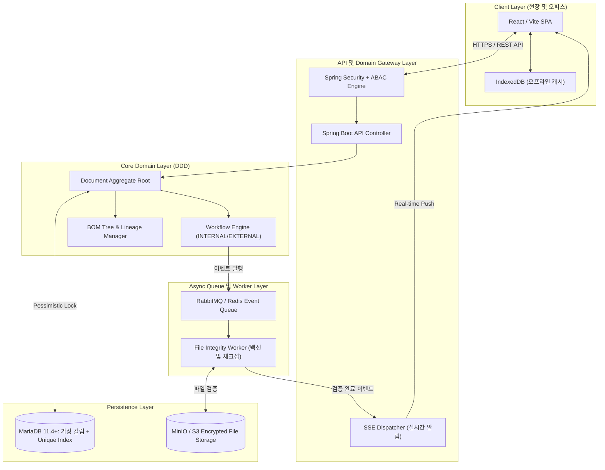

- 작성일: 2026-07-21
- 작성자: PRODEV

안녕하세요, **PRODEV**입니다.

제안서 기반으로 시스템을 구현할 때의 **전체 기술 스택 및 소프트웨어·하드웨어 아키텍처 구성도(System Architecture Configuration)**를 정리하였습니다.

## 1. 전체 시스템 컴포넌트 구성도
시스템은 프론트엔드(React/Vite), 백엔드 애플리케이션(Spring Boot), 비동기 이벤트/메시지 브로커(RabbitMQ), 데이터베이스(MySQL/PostgreSQL), 파일 스토리지(MinIO/S3)의 5대 핵심 컴포넌트로 구성됩니다.

## 2. 계층별 기술 스택 구성 (Tech Stack)

### 2.1. 프론트엔드 계층 (Frontend Layer)
- **Framework**: React 18 + Vite (최적의 빌드 속도 및 SPA 구현)
- **State & Server Cache**: React Query (TanStack Query v5) - 백엔드 SSE 이벤트 수신 시 `invalidateQueries`로 캐시 무효화
- **Real-Time Client**: EventSource API (SSE 전용 싱글톤 디스패처)
- **Offline Storage**: IndexedDB (`idb` 라이브러리) - 음영 지역 대비 승인 도면 메타데이터 프리패치
- **Data Visualization**: D3.js / Mermaid.js - BOM 계층 트리 및 N:M 연관망 시각화

### 2.2. 백엔드 및 도메인 계층 (Backend Domain Layer)
- **Framework**: Spring Boot 3.x (Java 17/21) - DDD Layered Architecture
- **보안 및 접근 제어**: Spring Security + JWT + ABAC (Attribute-Based Access Control)
  - 결재 권한, 사용자 부서/직급, 문서 보안 등급(1~5), 담당 기종 속성을 결합하여 인가 판정
- **핵심 엔진 모듈**:
  - `ApprovalEngine`: 사내 기안 문서(`INTERNAL`) N단계 결재 처리 및 `ApprovalAuditLog` 서명 스냅샷 생성
  - `ExternalIngestionEngine`: 외부 수령 도면(`EXTERNAL`) 결재 생략(`BYPASSED`) 및 자동 수령 등록
  - `LineageManager`: `previous_version_id` 역방향 단선 이력 추적 및 비관적 락(`SELECT ... FOR UPDATE`) 만료 제어

### 2.3. 비동기 이벤트 및 무결성 검증 계층 (Async & Worker Layer)
- **Message Broker**: RabbitMQ 또는 Redis Pub/Sub
- **Background Worker Process**:
  - SHA256 체크섬 무결성 계산
  - ClamAV 등 백신 API를 연동한 외부 유입 파일 바이러스 스캔
  - DWG/DXF/PDF 포맷 유효성 검사
  - 검증 성공 시 `FileVerifiedEvent` 발행 → 부모 문서 라이프사이클을 `ACTIVE`로 격상

### 2.4. 데이터 저장 및 물리 통제 계층 (Persistence Layer)
- **RDBMS**: **MariaDB 11.4+ (LTS)**
  - **가상 컬럼 (Generated Column)**: `active_part_key` (`VARCHAR(150) GENERATED ALWAYS AS (CASE WHEN status='ACTIVE' THEN CONCAT(part_no, '_', model_group) ELSE NULL END) STORED`)
  - **물리적 유니크 인덱스 (Unique Index)**: MariaDB 엔진 차원에서 유일 `ACTIVE` 도면 상태 강제
  - **비관적 쓰기 락 (Pessimistic Lock)**: `SELECT ... FOR UPDATE` 구문으로 개정 처리 시 동시성 레이스 컨디션 방지
- **Object Storage**: MinIO (On-Premise) 또는 AWS S3
  - `PENDING` 버킷: 무결성 검증 전 파일 대기 구역
  - `ACTIVE` 버킷: 검증 완료 후 최종 배포 구역 (암호화 저장)

## 3. 데이터 흐름 구성 시나리오

| 구분 | 사내 작성 문서/도면 (INTERNAL) | 외부 수령 도면/문서 (EXTERNAL) |
| - | - | - |
| **1단계: 등록** | 기안 작성 → 결재 상신 (`UNDER_REVIEW`) | 외부 파일 수령 등록 (`BYPASSED`) |
| **2단계: 검증/승인** | N단계 결재자 승인 (`APPROVED`) | 사내 결재 없이 비동기 검증 큐 투입 |
| **3단계: 파일 검사** | 백그라운드 파일 무결성 검사 | 백그라운드 파일 무결성 검사 |
| **4단계: 활성화** | 파일 검증 완료 시 `ACTIVE` 전이 | 파일 검증 완료 시 `ACTIVE` 전이 |
| **5단계: 배포/동기화** | SSE 알림 → UI 갱신 & IndexedDB 반영 | SSE 알림 → UI 갱신 & IndexedDB 반영 |

> [!tip] 실무 구성을 위한 핵심 권장 사항
> 프론트엔드는 React Query와 SSE 조합으로 실시간 반응형 UI를 구축하고, 백엔드는 Spring Boot 내 도메인 이벤트를 분리하여 개발 시 복잡도를 최소화하는 것이 효과적입니다.
