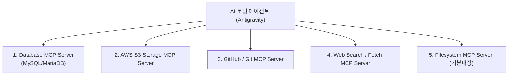

작성일: 2026년 7월 21일
작성자: PRODEV

## 1. 도입부 및 개요
안녕하세요, **PROCPA**입니다.
AI 하네스 엔지니어링 4대 요소 중 **4번째 요소: 외부 도구 연결 (MCP - Model Context Protocol)**을 DMS 프로젝트에 적용할 수 있는 구체적 MCP 서버 추천 및 활용 방안을 제시합니다.

MCP(Model Context Protocol)는 AI 에이전트가 데이터베이스, 파일 저장소(AWS S3), Git 버전관리, 외부 API 및 웹 브라우저와 **안전하고 규격화된 방식으로 직접 연동하여 작업할 수 있게 해주는 에이전트 인터페이스**입니다.

---

## 2. DMS 프로젝트용 추천 5대 MCP 서버 구성

---

## 3. 5대 MCP 서버별 역할 및 활용 시나리오

### 3.1. [1] Database MCP (MySQL / MariaDB MCP Server)
- **역할**: 백엔드 데이터베이스에 직접 연결하여 스키마 구조를 조회하고 쿼리를 테스트합니다.
- **실무 활용**:
  - 하네스 핀 맵(`harness_pin_map`) 및 BOM(`harness_bom`) 테이블이 올바르게 생성되었는지 스키마 직접 검증
  - 파서 모듈 개발 후 테스트 데이터가 DB에 정상 적재되었는지 `SELECT` 쿼리로 결과 확인

### 3.2. [2] AWS S3 Storage MCP Server
- **역할**: AWS S3 버킷 내의 도면 파일(PDF, STEP, CAD) 및 엑셀 핀 맵 원본을 직접 조회하고 테스트합니다.
- **실무 활용**:
  - 도면 업로드 시 S3 Presigned URL 정상 발급 여부 검증
  - S3 버킷에 적재된 하네스 엑셀 파일 샘플 직접 다운로드 및 파싱 테스트

### 3.3. [3] Git / GitHub MCP Server
- **역할**: Git 저장소 조작, 브랜치 관리, 커밋 및 PR(Pull Request) 생성을 자동화합니다.
- **실무 활용**:
  - `feature/harness-domain` 브랜치 자동 생성
  - 미션 완료 시 개별 기능 단위로 Commit 메시지 작성 후 GitHub PR 자동 상신

### 3.4. [4] Web Search / Fetch MCP (웹/Datasheet 검색 MCP)
- **역할**: 전장 커넥터 및 단자 제조사(YAZAKI, KET, TE Connectivity 등)의 핀 사양(Datasheet) 웹 정보를 검색합니다.
- **실무 활용**:
  - 설계자가 입력한 커넥터 품번(예: KET-MG641234)의 제조사 표준 핀 스펙 및 방수 사양 자동 검색 및 검증

### 3.5. [5] Local Filesystem MCP (기본 내장 MCP)
- **역할**: DMS 프로젝트 소스코드 및 문서 파일 읽기/쓰기/검색 (`view_file`, `write_to_file`, `grep_search` 등)
- **실무 활용**:
  - 백엔드 JPA 엔티티 및 프론트엔드 컴포넌트 파일 자동 생성 및 수정

---

## 4. MCP 서버 추천 및 활용 요약 표

| MCP 서버 종류 | 대상 시스템 | 핵심 기능 | DMS 연동 이점 |
|---|---|---|---|
| **Database MCP** | MySQL / MariaDB | DB 스키마 및 데이터 SQL 직접 조회 | DB 데이터 적재 무결성 자동 검증 |
| **AWS S3 MCP** | Amazon S3 | S3 객체 목록 조회 및 Presigned URL 테스트 | 도면 파일 저장 및 접근성 자동 검증 |
| **Git / GitHub MCP** | GitHub / GitLab | Branch 생성, Commit, PR 자동 상신 | 기능 구현 후 자동 버전관리 및 코드리뷰 |
| **Web / Fetch MCP** | 외부 웹 사이트 | 커넥터 부품 Datasheet 핀 스펙 검색 | 하네스 메타데이터 정확도 검증 |

---

## 5. 마치며
DMS 하네스 시스템 개발 시 **Database MCP**와 **Git MCP**를 연동해 두시면, AI 에이전트가 코드를 작성하는 것에 그치지 않고 **DB 데이터 검증 및 Git PR 상신까지 완벽히 전자동으로 처리**하게 됩니다.
