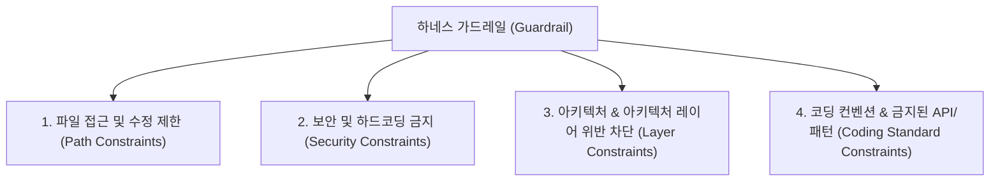

작성일: 2026년 7월 21일
작성자: PRODEV

## 1. 도입부 및 개요
안녕하세요, **PROCPA**입니다.
AI 하네스 엔지니어링의 핵심 4대 요소 중 하나인 **가드레일(Guardrail)**을 DMS 시스템에 지정하는 방법과 절차를 예시와 함께 제시합니다.

가드레일은 AI 에이전트가 코드를 생성하거나 파일 시스템에 접근할 때 **기밀 유출, 아키텍처 파괴, 금지된 패키지/패턴 사용, 지정 범위 밖의 파일 무단 수정 및 환각(Hallucination)을 사전 차단하는 안전장치**입니다.

---

## 2. 하네스 가드레일(Guardrail)의 4대 핵심 영역
에이전틱 개발 환경에서 지정해야 하는 가드레일은 아래 4가지 범주로 구분됩니다.



---

## 3. 가드레일 지정 4단계 실무 절차

### 3.1. [1단계] `.agents/AGENTS.md` 전역 규칙에 `[GUARDRAIL]` 명시
에이전트가 작업할 때 가장 먼저 읽는 전역 지침서인 `.agents/AGENTS.md` 파일에 절대 위반해선 안 되는 **강제 제약 사항(MUST NOT / DO NOT)**을 선언합니다.

### 3.2. [2단계] 디렉터리 접근 권한 및 수정 금지 파일 지정
에이전트가 무단으로 변경해서는 안 되는 환경 파일(`.env`, `application.yml`, `.git`, 보안 설정 파일)을 명확히 격리합니다.

### 3.3. [3단계] 코드 레벨 가드레일 (금지된 문법 및 아키텍처 규칙) 지정
실무 개발 시 발생할 수 있는 안티 패턴을 사전 금지합니다.
- Controller에서 Repository 직접 호출 금지 (반드시 Service 레이어 경유)
- `System.out.println()` 사용 금지 (`log.info()` 또는 Slf4j 사용 강제)
- `@CrossOrigin("*")` 전역 허용 금지 (`CorsConfig.java` 보안 설정 준수)

### 4.4. [4단계] 가드레일 위반 시 예외 처리 동작(Fallback Rules) 정의
가드레일을 위반하는 코드가 생성되었을 때 에이전트가 취해야 할 정정 절차를 명시합니다.

---

## 4. [실전 예시] `.agents/AGENTS.md`에 등록하는 가드레일 구체적 예시

아래 내용을 프로젝트 전역 규칙 파일에 반영하면 AI 에이전트가 강력하게 통제됩니다.

```markdown
## 2. 하네스 바이브 코딩 가드레일 (Guardrails)

### 2.1. [보안/기밀 통제] Security Constraints
- **하드코딩 금지**: AWS S3 Access Key, Secret Key, Database 비밀번호, JWT Secret을 코드 내에 직접 문자열로 하드코딩하는 행위를 엄격히 금지합니다. (반드시 `@Value("${property}")` 또는 `application.yml` 환경변수 참조)
- **보안 설정 수정 금지**: `com.dms.backend.global.config` 하위의 보안/CORS 설정 파일은 사용자 승인 없이 무단 변경하지 마십시오.

### 2.2. [파일/경로 수정 통제] Path Constraints
- **수정 금지 파일**: `.env`, `.gitignore`, `build.gradle`, `application-local.yml` 파일은 사전에 명시적 사용자 요청이 없는 한 임의로 수정하지 마십시오.
- **결과물 저장 위치**: 분석 보고서나 가이드 파일은 반드시 `results/` 디렉터리 내에만 작성해야 합니다.

### 2.3. [아키텍처/계층 통제] Layering Constraints
- **레이어 위반 차단**: REST Controller에서 `JpaRepository`를 직접 주입받아 호출하는 것은 금지됩니다. 반드시 Service 레이어(`*Service.java`)를 거쳐야 합니다.
- **응답 통일**: 백엔드 API 반환 타입으로 엔티티(Entity) 객체를 직접 반환하는 것을 금지합니다. 반드시 DTO 객체 및 `ApiResponse.of()` 래퍼를 사용하십시오.

### 2.4. [코딩 표준 통제] Code Quality Constraints
- **콘솔 출력 금지**: `System.out.println()` 또는 `e.printStackTrace()` 사용을 금지하며, 반드시 `@Slf4j` 기반의 `log.error()`, `log.info()`를 사용하십시오.
- **Query patterns**: JPA 사용 시 N+1 문제가 발생하지 않도록 Fetch Join 또는 EntityGraph를 고려하십시오.
```

---

## 5. 단계별 가드레일 구성 요약 표

| 단계 | 가드레일 영역 | 주요 제약 예시 | 통제 방식 |
|---|---|---|---|
| **1** | 보안/기밀 | API Key, Secret 하드코딩 차단 | `.agents/AGENTS.md` 규칙 및 환경변수 주입 |
| **2** | 시스템/파일 | `.env`, `build.gradle` 무단 편집 차단 | 파일 접근 권한 설정 & 금지 경로 명시 |
| **3** | 아키텍처 | Controller -> Repository 직접 참조 차단 | 레이어 간 참조 지침 선언 |
| **4** | 코드 품질 | `System.out.println` 금지, Entity 직접 반환 차단 | Linter 및 공통 DTO 반환 강제 |

---

## 6. 마치며
가드레일 지정의 핵심은 **"AI 에이전트에게 하지 말아야 할 경계선(Boundary)을 명확하게 알려주는 것"**입니다.

이 가드레일을 `.agents/AGENTS.md` 파일에 바로 반영해 두시면, AI가 자유롭게 바이브 코딩을 진행하더라도 보안 유출이나 아키텍처 파괴 없이 매우 안전하고 우수한 코드를 생성하게 됩니다.
