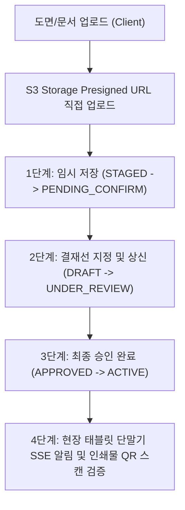

작성일: 2026년 7월 21일
작성자: PRODEV

## 1. 도입부 및 개요
안녕하세요, **PROCPA**입니다.
본 문서는 DMS(결재문서도면관리) 시스템 개발 시 AI 코딩 에이전트(Antigravity 등)가 탈선이나 환각(Hallucination) 없이 오직 지정된 설계대로만 정확히 코드를 작성하도록 에이전트를 둘러싸는 **'에이전틱 하네스 (Agentic Harness Framework)'의 1번째 요소: 전역 지시문서 (Instruction Specification)**입니다.

에이전틱 하네스 체계 하에서 AI 에이전트는 본 문서에 정의된 DMS 시스템 명세 및 구현 미션만을 엄격히 준수하여 순차적으로 개발을 진행합니다.

---

## 2. DMS(결재문서도면관리) 시스템 핵심 도메인 개요
기존 DMS 개요서(`docs/260721_결재문서도면관리_시스템개요서.md`)에 정의된 핵심 결재 및 도면 관리 도메인 아키텍처입니다.

---

## 3. [에이전틱 하네스 미션 1~4] DMS 구현 프롬프트 단위

AI 에이전트는 아래 4단계 구현 미션을 순서대로 실행합니다.

### [미션 1] DMS 공통 응답 및 예외 처리 아키텍처 점검
- `com.dms.backend.global.common.ApiResponse` 표준 응답 클래스 및 `CustomException` 예외 처리기 점검 및 적용

### [미션 2] DMS 백엔드 도면/결재 핵심 엔티티 구현
- DMS 도관 엔티티 (`Document`, `Drawing`, `ApprovalLine`, `AuditLog`) 및 JPA Repository 구현

### [미션 3] DMS 백엔드 REST API Controller & Service 작성
- 도면 등록 API, 결재 상신/승인/반려 API, S3 Presigned URL 발급 API 구현

### [미션 4] 프론트엔드(React + Vite) 도면 관리 및 결재 UI 구축
- 도면 등록 폼, 결재선 지정 모달, PDF 도면 Viewer 컴포넌트 개발

---

## 4. 마치며
본 지시문서는 에이전틱 하네스 4대 안전 요소(지시문서, 가드레일, 피드백루프, MCP) 중 1번째 축으로서 AI 바이브 코딩의 명확한 가이드라인 역할을 수행합니다.
