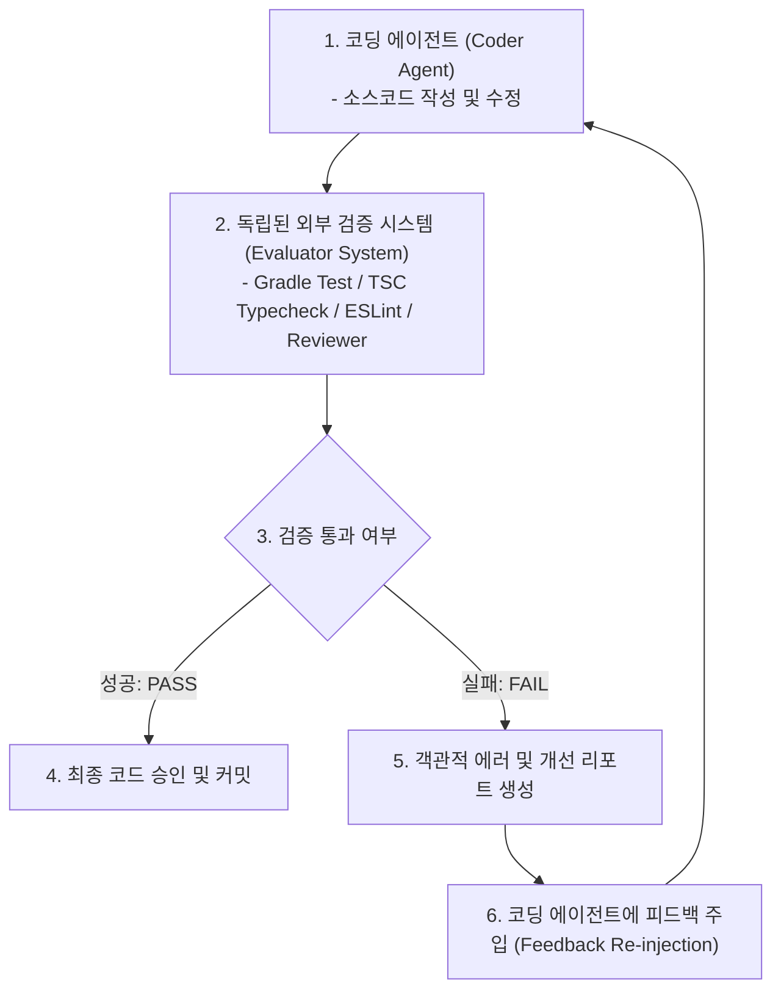

작성일: 2026년 7월 21일
작성자: PRODEV

## 1. 도입부 및 개요
안녕하세요, **PROCPA**입니다.
AI 하네스 엔지니어링의 **피드백 루프(Feedback Loop)**는 코드를 생성하는 '개발 에이전트(Coder)'가 자기 코드를 직접 셀프 평가하는 것이 아니라, **독립된 외부 검증기(Automated Test Runner/Linter) 및 검증 전문 에이전트(Evaluator/Reviewer Agent)**에 의해 객관적 피드백을 전달받는 **관단 분리(Separation of Concerns) 아키텍처**입니다.

코딩 에이전트가 본인의 편향(Self-Bias)에 빠지지 않고 높은 품질의 코드를 생산하기 위해서는 검증 주체를 완전히 분리해야 합니다.

---

## 2. 개발 에이전트와 검증 주체 분리 아키텍처



---

## 3. 피드백 루프의 2대 분리(Separation) 수준

### 3.1. [수준 1] 시스템 수준 분리 (System-Level Feedback)
- 코드를 작성한 에이전트의 주관을 배제하고, **Spring Gradle Test Runner, TypeScript Compiler, Linter** 등 100% 객관적인 외부 빌드 시스템이 실행한 결과(Pass/Fail 로그)만을 에이전트에 피드백하는 구조입니다.

### 3.2. [수준 2] 에이전트 역할 분리 (Agent-Level Cross Validation)
- **개발 에이전트 (Coder Agent)**: 기능 구현 및 코드 작성 전담
- **검증 에이전트 (Evaluator / Reviewer Subagent)**: 작성된 코드를 독립적인 관점에서 리뷰하고, 에지 케이스(Edge Case) 테스트 코드를 직접 작성하여 검증
- 작성자와 검증자의 역할을 완전히 분리(Subagent 분리)하여 시너지를 창출합니다.

---

## 4. [.agents/AGENTS.md] 자율 피드백 루프 규칙

```markdown
## 전역 자율 피드백 루프 (Autonomic Feedback Loop)
- **외부 검증기 기반 평가**: 코딩 에이전트는 작성한 코드를 스스로 자평하지 않으며, 반드시 외부 검증 도구(`./gradlew test`, `npx tsc --noEmit`)의 객관적 실행 리포트에 기반하여 평가할 것.
- **서브에이전트 교차 검증**: 복잡한 비즈니스 로직 작성 시 검증 서브에이전트(Reviewer Agent)를 호출하여 테스트 케이스 통과 여부를 제3자 시각에서 검증받을 것.
- **오류 자가 정정 (Self-Correction)**: 외부 검증 시스템에서 실패(Compilation Error / StackTrace) 수집 시 해당 피드백을 수용하여 소스코드를 정정할 것.
```

---

## 5. 마치며
사용자께서 지적해 주신 대로 **"피드백 주체와 개발 주체의 분리"**는 에이전틱 하네스의 핵심 성공 요인입니다. 코딩 에이전트는 오직 외부 검증 시스템과 검증 서브에이전트가 발급한 객관적 리포트에만 의존하여 정정을 수행합니다.
